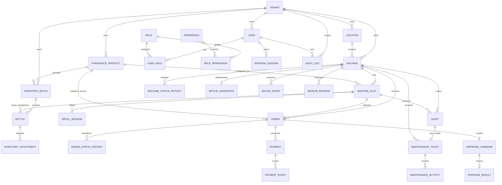

# DATABASE DESIGN — SCENTSTATION

## 1. Mục tiêu thiết kế

Thiết kế cơ sở dữ liệu phục vụ Business Requirements và Use Case của ScentStation với các ưu tiên:

- Cô lập dữ liệu nhiều thương hiệu.
- Tính nhất quán của order, payment và dispense.
- Chống xử lý trùng ở cả webhook và command.
- Truy vết đầy đủ tồn kho, refill, bảo trì và audit.
- Hỗ trợ Web-first bằng simulator nhưng có thể tích hợp MQTT sau này.

## 2. Công nghệ và quy ước

| Thành phần | Lựa chọn |
|---|---|
| DBMS | PostgreSQL |
| ORM | Prisma |
| ID | UUID do ứng dụng hoặc PostgreSQL tạo |
| Thời gian | `timestamptz`, lưu UTC |
| Tiền | `numeric(19,4)` + `char(3)` currency |
| Lượng/khối lượng | `numeric(14,4)` |
| Dữ liệu linh hoạt | `jsonb` |
| Xóa nghiệp vụ | Soft delete/trạng thái; không xóa transaction và audit |
| Tên bảng/cột | `snake_case` |

Mọi bảng tenant-owned phải có `tenant_id NOT NULL`, trừ bảng toàn nền tảng hoặc bảng con chỉ truy cập thông qua cha và vẫn nên giữ `tenant_id` nếu cần bảo vệ/index trực tiếp.

## 3. ERD tổng thể



## 4. Enum đề xuất

### 4.1. Trạng thái chung

```text
TenantStatus       = ACTIVE | SUSPENDED | DISABLED
UserStatus         = INVITED | ACTIVE | LOCKED | DISABLED
MachineStatus      = ONLINE | UNSTABLE | OFFLINE | MAINTENANCE | DISABLED | ERROR
SlotStatus         = AVAILABLE | DISABLED | EMPTY | LOW_STOCK | MAINTENANCE | ERROR
BottleStatus       = AVAILABLE | INSTALLED | LOW | EMPTY | REMOVED | DAMAGED | EXPIRED | DISPOSED
```

### 4.2. Order/payment/dispense

```text
OrderStatus = PENDING_PAYMENT | PAYMENT_FAILED | CANCELLED | EXPIRED
            | PAID | DISPENSING | DISPENSED | DISPENSE_FAILED
            | DISPENSE_UNKNOWN | REFUND_PENDING | REFUNDED

PaymentStatus = PENDING | SUCCEEDED | FAILED | CANCELLED | EXPIRED
              | REFUND_PENDING | PARTIALLY_REFUNDED | REFUNDED

CommandStatus = CREATED | SENT | ACKNOWLEDGED | SUCCEEDED
              | FAILED | REJECTED | EXPIRED | UNKNOWN

DispenseType = CUSTOMER | DIAGNOSTIC
```

### 4.3. Vận hành

```text
AlertSeverity = INFO | WARNING | HIGH | CRITICAL
AlertStatus   = OPEN | ACKNOWLEDGED | IN_PROGRESS | RESOLVED | CLOSED
TicketStatus  = OPEN | ASSIGNED | IN_PROGRESS | WAITING_PART | POST_TEST
              | RESOLVED | CLOSED | REOPENED
TicketPriority = LOW | MEDIUM | HIGH | CRITICAL
```

Trong migration có thể dùng PostgreSQL enum hoặc `varchar + CHECK`. Với Prisma, enum được quản lý trong schema và migration.

## 5. Data dictionary

### 5.1. Tenant và RBAC

#### `tenants`

| Cột | Kiểu | Ràng buộc/Mô tả |
|---|---|---|
| id | uuid | PK |
| code | varchar(50) | UNIQUE, mã tenant không đổi |
| name | varchar(200) | NOT NULL |
| logo_url | text | Nullable |
| description | text | Nullable |
| contact_info | jsonb | Email, điện thoại, địa chỉ |
| kiosk_content | jsonb | Nội dung hiển thị theo thương hiệu |
| status | TenantStatus | NOT NULL |
| created_at, updated_at | timestamptz | NOT NULL |

#### `users`

| Cột | Kiểu | Ràng buộc/Mô tả |
|---|---|---|
| id | uuid | PK |
| tenant_id | uuid | FK tenants; nullable chỉ cho platform user |
| email | citext | NOT NULL |
| password_hash | text | NOT NULL |
| full_name | varchar(200) | NOT NULL |
| status | UserStatus | NOT NULL |
| permission_version | integer | Tăng khi thay quyền |
| last_login_at | timestamptz | Nullable |
| created_at, updated_at | timestamptz | NOT NULL |

Ràng buộc: unique email chuẩn hóa toàn hệ thống hoặc `UNIQUE(tenant_id, email)` nếu cho phép một email ở nhiều tenant. Web MVP đề xuất email duy nhất toàn hệ thống để đơn giản hóa đăng nhập.

#### `roles`, `permissions`, `user_roles`, `role_permissions`

- `roles`: `id`, `tenant_id` nullable cho role nền tảng, `code`, `name`, `is_system`.
- `permissions`: `id`, `code UNIQUE`, `description`.
- `user_roles`: `user_id`, `role_id`, `scope_type`, `scope_id`, PK ghép phù hợp.
- `role_permissions`: `role_id`, `permission_id`, PK ghép.

Ràng buộc ứng dụng/database trigger: role tenant chỉ được gán cho user cùng tenant; Brand Admin không được cấp platform permission.

#### `refresh_sessions`

- `id`, `user_id`, `token_hash`, `expires_at`, `revoked_at`.
- `ip_address`, `user_agent`, `created_at`, `last_used_at`.
- Chỉ lưu hash của refresh token.

Use case: UC-W01–UC-W05.

### 5.2. Địa điểm, sản phẩm, máy và ngăn

#### `locations`

- `id`, `tenant_id`, `code`, `name`, `address`, `timezone`, `status`.
- `UNIQUE(tenant_id, code)`.

#### `fragrance_products`

- `id`, `tenant_id`, `sku`, `name`, `description`.
- `fragrance_notes jsonb`, `image_url`, `product_url`.
- `default_price numeric(19,4)`, `currency char(3)`.
- `status`, `created_at`, `updated_at`, `deleted_at`.
- `UNIQUE(tenant_id, sku)`.

#### `machines`

| Cột | Kiểu | Mô tả |
|---|---|---|
| id | uuid | PK |
| tenant_id | uuid | Tenant sở hữu |
| location_id | uuid | FK location cùng tenant |
| serial_number | varchar(100) | Định danh máy |
| display_name | varchar(200) | Tên hiển thị |
| status | MachineStatus | Trạng thái hiện tại |
| operating_mode | varchar(30) | NORMAL/MAINTENANCE... |
| last_seen_at | timestamptz | Nullable |
| firmware_version | varchar(100) | Dự phòng IoT |
| configuration_version | integer | Optimistic version |
| simulator_enabled | boolean | Chỉ môi trường phát triển/demo |
| created_at, updated_at | timestamptz | NOT NULL |

Ràng buộc: `UNIQUE(tenant_id, serial_number)`; location và machine phải cùng tenant.

#### `machine_slots`

| Cột | Kiểu | Mô tả |
|---|---|---|
| id | uuid | PK |
| tenant_id | uuid | Tenant scope |
| machine_id | uuid | FK machines |
| slot_number | integer | Số ngăn |
| fragrance_product_id | uuid | FK product cùng tenant |
| active_bottle_id | uuid | FK bottle, nullable |
| price_per_spray | numeric(19,4) | Giá hiện tại |
| currency | char(3) | ISO 4217 |
| calibrated_dosage_ml | numeric(10,4) | Liều lượng dự kiến |
| low_stock_threshold_ml | numeric(14,4) | Ngưỡng cảnh báo |
| estimated_remaining_ml | numeric(14,4) | Không âm |
| estimated_remaining_sprays | integer | Không âm |
| status | SlotStatus | Trạng thái hiện tại |
| version | integer | Optimistic concurrency |

Ràng buộc:

- `UNIQUE(machine_id, slot_number)`.
- `UNIQUE(active_bottle_id)` với điều kiện khác null.
- Check giá và các đại lượng không âm.
- Product, machine và bottle phải cùng tenant.

#### `machine_status_histories`

- `id`, `tenant_id`, `machine_id`, `from_status`, `to_status`.
- `reason`, `source`, `changed_by`, `occurred_at`.

Use case: UC-W06–UC-W10, UC-I05.

### 5.3. Tồn kho

#### `inventory_batches`

- `id`, `tenant_id`, `fragrance_product_id`, `batch_number`.
- `received_at`, `expires_at`, `quantity_received`, `supplier_info jsonb`.
- `UNIQUE(tenant_id, fragrance_product_id, batch_number)`.

#### `bottles`

- `id`, `tenant_id`, `batch_id`, `fragrance_product_id`.
- `identifier`, `status`.
- `initial_volume_ml`, `current_estimated_ml`.
- `empty_weight_g`, `initial_measured_weight_g`, `current_measured_weight_g`.
- `opened_at`, `installed_at`, `removed_at`, `expires_at`.
- `UNIQUE(tenant_id, identifier)`.

#### `refill_sessions`

| Cột | Mô tả |
|---|---|
| id, tenant_id | Định danh và scope |
| machine_id, slot_id | Máy/ngăn thực hiện |
| old_bottle_id, new_bottle_id | Chai cũ/mới |
| performed_by | User thực hiện |
| started_at, completed_at | Thời gian |
| before_weight_g, after_weight_g | Số đo trước/sau |
| notes | Ghi chú |
| status | STARTED/COMPLETED/CANCELLED |

#### `inventory_adjustments`

- `id`, `tenant_id`, `bottle_id`, `slot_id` nullable.
- `before_quantity_ml`, `after_quantity_ml`, `difference_ml`.
- `reason NOT NULL`, `adjusted_by`, `created_at`.
- Không update/delete sau khi tạo; sửa sai bằng adjustment đảo.

Use case: UC-W11–UC-W13.

### 5.4. Order và payment

#### `orders`

| Cột | Kiểu | Mô tả |
|---|---|---|
| id | uuid | PK |
| tenant_id | uuid | Tenant snapshot |
| machine_id, slot_id | uuid | Máy/ngăn được chọn |
| fragrance_product_id | uuid | Sản phẩm nguồn |
| product_name_snapshot | varchar(200) | Không đổi theo catalog |
| amount | numeric(19,4) | `> 0` hoặc `>= 0` nếu free trial |
| currency | char(3) | Currency snapshot |
| status | OrderStatus | Trạng thái hiện tại |
| payment_reference | varchar(150) | UNIQUE |
| idempotency_key | varchar(150) | UNIQUE theo kiosk/client |
| expires_at | timestamptz | NOT NULL |
| paid_at, dispensed_at | timestamptz | Nullable |
| failure_code | varchar(100) | Nullable |
| refund_status | varchar(30) | Nullable |
| created_at, updated_at | timestamptz | NOT NULL |

#### `order_status_histories`

- `id`, `tenant_id`, `order_id`.
- `from_status`, `to_status`, `reason`, `metadata jsonb`.
- `actor_type`, `actor_id`, `occurred_at`.
- Append-only.

#### `payments`

- `id`, `tenant_id`, `order_id`, `provider`.
- `provider_transaction_id`, `provider_reference`.
- `amount`, `currency`, `status`.
- `raw_response jsonb`, `paid_at`, `created_at`, `updated_at`.
- `UNIQUE(provider, provider_transaction_id)` khi transaction ID khác null.
- Index `order_id`, `provider_reference`.

#### `payment_events`

- `id`, `tenant_id`, `payment_id` nullable, `provider`.
- `provider_event_id`, `payload_hash`, `signature_valid`.
- `payload jsonb`, `received_at`, `processed_at`, `processing_result`.
- `UNIQUE(provider, provider_event_id)`.
- Nếu provider không cấp event ID: unique theo `provider + payload_hash` có chính sách phù hợp.

Use case: UC-W15–UC-W17, UC-W20–UC-W21.

### 5.5. Dispense

#### `dispense_commands`

| Cột | Kiểu | Mô tả |
|---|---|---|
| id | uuid | PK và command ID |
| tenant_id | uuid | Scope |
| order_id | uuid | FK orders, UNIQUE đối với customer command |
| machine_id, slot_id | uuid | Đích |
| command_type | DispenseType | CUSTOMER/DIAGNOSTIC |
| command_token | varchar(255) | UNIQUE |
| signature | text | Chữ ký command |
| status | CommandStatus | Trạng thái |
| expires_at | timestamptz | Hạn hiệu lực |
| sent_at, acknowledged_at, completed_at | timestamptz | Nullable |
| retry_count | integer | Số lần gửi lại cùng ID |
| created_by | uuid | Nullable cho system |
| created_at | timestamptz | NOT NULL |

Đối với diagnostic command, `order_id` null và phải có user có quyền. Có thể dùng partial unique index:

```sql
CREATE UNIQUE INDEX uq_customer_command_order
ON dispense_commands(order_id)
WHERE order_id IS NOT NULL AND command_type = 'CUSTOMER';
```

#### `dispense_results`

- `id`, `tenant_id`, `command_id UNIQUE`.
- `success`, `result_code`, `failure_code`.
- `executed_at`, `received_at`.
- `measured_quantity_ml`, `sensor_snapshot jsonb`, `raw_payload jsonb`.
- `device_event_id` nullable và unique theo device khi có.

Use case: UC-W18, UC-W19, UC-I03.

### 5.6. Cảnh báo và bảo trì

#### `alerts`

- `id`, `tenant_id`, `machine_id`, `slot_id` nullable.
- `type`, `severity`, `status`, `deduplication_key`.
- `title`, `description`, `first_occurred_at`, `last_occurred_at`, `occurrence_count`.
- `acknowledged_by/at`, `assigned_to`, `resolved_by/at`, `resolution`.
- Partial unique index cho một alert unresolved theo `deduplication_key`.

#### `maintenance_tickets`

- `id`, `tenant_id`, `machine_id`, `source_alert_id` nullable.
- `ticket_number`, `category`, `severity`, `priority`, `status`.
- `assigned_to`, `due_at`, `started_at`, `resolved_at`, `closed_at`.
- `diagnosis`, `corrective_action`, `replacement_parts jsonb`, `cost`.
- `post_test_result`, `post_tested_by/at`, `downtime_minutes`.
- `UNIQUE(tenant_id, ticket_number)`.

#### `maintenance_activities`

- `id`, `tenant_id`, `ticket_id`, `actor_id`.
- `activity_type`, `from_status`, `to_status`, `notes`, `attachments jsonb`, `created_at`.
- Append-only.

Use case: UC-W22–UC-W24.

### 5.7. IoT dự phòng

#### `device_credentials`

- `id`, `machine_id UNIQUE`, `credential_identifier UNIQUE`.
- Chỉ lưu public key/certificate fingerprint hoặc secret hash.
- `status`, `issued_at`, `expires_at`, `revoked_at`, `last_authenticated_at`.

#### `device_events`

- `id`, `tenant_id`, `machine_id`, `device_event_id`.
- `event_type`, `occurred_at`, `received_at`, `payload jsonb`.
- `UNIQUE(machine_id, device_event_id)` để đồng bộ idempotent.
- Có thể partition theo `occurred_at` khi dữ liệu lớn.

#### `sensor_readings`

- `id`, `tenant_id`, `machine_id`, `slot_id` nullable.
- `reading_type`, `numeric_value`, `unit`, `payload jsonb`.
- `measured_at`, `received_at`.
- Partition/retention policy được quyết định khi triển khai IoT.

Use case: UC-I01–UC-I05.

### 5.8. Audit và notification

#### `audit_logs`

- `id`, `tenant_id` nullable cho platform event.
- `actor_type`, `actor_id`, `action`.
- `target_type`, `target_id`.
- `source_ip`, `user_agent`, `severity`.
- `before_data jsonb`, `after_data jsonb`, `metadata jsonb`.
- `occurred_at`.
- Append-only; application role không có quyền UPDATE/DELETE.

#### `notifications`

- `id`, `tenant_id`, `recipient_user_id`, `type`, `channel`.
- `subject`, `content`, `status`, `sent_at`, `read_at`, `created_at`.

Use case: UC-W22, UC-W27.

## 6. Ràng buộc toàn vẹn quan trọng

### 6.1. Tenant isolation

- Mọi repository/service nhận `tenantId` từ authenticated context, không nhận tùy ý từ client.
- Composite foreign key hoặc trigger bảo đảm các entity liên kết cùng tenant.
- Index bắt đầu bằng `tenant_id` cho truy vấn tenant phổ biến.
- PostgreSQL Row-Level Security là lớp phòng vệ bổ sung.
- Platform operation phải dùng đường xử lý và quyền riêng, không vô hiệu tenant scope mặc định tùy tiện.

RLS minh họa:

```sql
ALTER TABLE orders ENABLE ROW LEVEL SECURITY;

CREATE POLICY tenant_orders_policy ON orders
USING (tenant_id = current_setting('app.tenant_id', true)::uuid)
WITH CHECK (tenant_id = current_setting('app.tenant_id', true)::uuid);
```

Service cần đặt `app.tenant_id` trong cùng transaction/connection. Không coi RLS là thay thế cho authorization tại backend.

### 6.2. Idempotency

| Nghiệp vụ | Khóa chống trùng |
|---|---|
| Tạo đơn từ kiosk | `orders.idempotency_key` |
| Webhook | `payment_events(provider, provider_event_id)` |
| Payment | `payments(provider, provider_transaction_id)` |
| Customer dispense | Partial unique `dispense_commands(order_id)` |
| Dispense result | `dispense_results.command_id` |
| Device event | `device_events(machine_id, device_event_id)` |
| Alert chưa xử lý | Partial unique/deduplication key |

### 6.3. Tiền và snapshot

- `orders.amount`, `currency`, `product_name_snapshot` không được cập nhật sau tạo, trừ migration có kiểm soát.
- Payment thành công chỉ hợp lệ khi amount/currency khớp snapshot order.
- Refund được lưu như trạng thái và sự kiện; không xóa payment ban đầu.

### 6.4. Tồn kho

- Các đại lượng không được âm.
- Chỉ dispense result thành công mới trừ tồn kho tự động.
- Diagnostic dispense cũng giảm lượng vật lý nhưng được phân loại riêng khỏi doanh số.
- Mọi điều chỉnh thủ công có `reason`, actor và audit.
- Cập nhật slot/bottle dùng row lock hoặc optimistic version để tránh ghi đè đồng thời.

## 7. Transaction nghiệp vụ

### 7.1. Xử lý payment thành công

```text
BEGIN
  INSERT payment_event (unique provider event)
  LOCK order
  validate signature/reference/amount/currency/status
  UPSERT payment (unique provider transaction)
  transition order PENDING_PAYMENT -> PAID
  INSERT order_status_history
COMMIT
enqueue/create dispense command idempotently
```

Nếu event đã tồn tại, trả kết quả idempotent. Có thể tạo command trong cùng transaction hoặc dùng transactional outbox; Web MVP ưu tiên cùng transaction nếu queue chưa cần độ tin cậy phân tán cao.

### 7.2. Hoàn tất lượt xịt

```text
BEGIN
  INSERT dispense_result ON CONFLICT DO NOTHING
  LOCK command, order, slot, bottle
  if result already processed: return idempotent
  update command status
  if success:
    transition order -> DISPENSED
    decrement estimated inventory
  else:
    transition -> DISPENSE_FAILED or DISPENSE_UNKNOWN
  INSERT order_status_history
  CREATE alert/manual-review record when required
COMMIT
```

### 7.3. Refill

```text
BEGIN
  LOCK machine_slot, old_bottle, new_bottle
  validate same tenant/product/status/expiry
  detach old bottle and change status
  attach new bottle and change status
  update slot estimates/status/version
  complete refill_session
  insert audit_log
COMMIT
```

## 8. Index đề xuất

| Bảng | Index |
|---|---|
| users | `(tenant_id, status)`, unique normalized `email` |
| machines | `(tenant_id, location_id, status)`, `(last_seen_at)` |
| machine_slots | `(tenant_id, machine_id, status)` |
| bottles | `(tenant_id, status, expires_at)`, `(batch_id)` |
| orders | `(tenant_id, created_at DESC)`, `(tenant_id, status, created_at)`, `(machine_id, created_at)` |
| payments | `(tenant_id, status, created_at)`, `(order_id)` |
| alerts | `(tenant_id, status, severity, created_at)` |
| maintenance_tickets | `(tenant_id, status, assigned_to, due_at)` |
| audit_logs | `(tenant_id, occurred_at DESC)`, `(actor_id, occurred_at)`, `(target_type, target_id)` |
| device_events | `(machine_id, occurred_at DESC)` |
| sensor_readings | `(machine_id, slot_id, measured_at DESC)` |

Index cuối cùng phải được xác nhận bằng dữ liệu/query thực tế; tránh tạo index cho mọi cột từ đầu.

## 9. State transition hợp lệ

| Từ | Đến hợp lệ chính |
|---|---|
| PENDING_PAYMENT | PAID, PAYMENT_FAILED, CANCELLED, EXPIRED |
| PAID | DISPENSING, REFUND_PENDING |
| DISPENSING | DISPENSED, DISPENSE_FAILED, DISPENSE_UNKNOWN |
| DISPENSE_FAILED | REFUND_PENDING, REFUNDED |
| DISPENSE_UNKNOWN | REFUND_PENDING, REFUNDED hoặc kết luận thủ công có kiểm soát |
| REFUND_PENDING | REFUNDED |

Không cho phép chuyển ngược tùy ý. Transition được thực hiện qua domain service, ghi history và audit khi nhạy cảm.

## 10. Mapping Use Case–Entity

| Use case | Entity chính |
|---|---|
| UC-W01–W02 | users, refresh_sessions, audit_logs |
| UC-W03–W06 | tenants, users, roles, permissions, user_roles, role_permissions |
| UC-W07–W10 | fragrance_products, locations, machines, machine_slots, machine_status_histories |
| UC-W11–W13 | inventory_batches, bottles, refill_sessions, inventory_adjustments |
| UC-W14–W17 | fragrance_products, machine_slots, orders, payments, payment_events, order_status_histories |
| UC-W18–W19 | dispense_commands, dispense_results, orders, machine_slots, bottles |
| UC-W20–W21 | orders, payments, payment_events, dispense_commands, dispense_results, audit_logs |
| UC-W22 | alerts, notifications |
| UC-W23–W24 | maintenance_tickets, maintenance_activities, machine_status_histories |
| UC-W25–W26 | orders, payments, dispense_results, bottles, alerts, maintenance_tickets |
| UC-W27 | audit_logs và các entity nguồn |
| UC-I01 | device_credentials, machines |
| UC-I02 | device_events, sensor_readings, machines, alerts |
| UC-I03 | dispense_commands, dispense_results, device_events |
| UC-I04 | device_events |
| UC-I05 | machines, machine_status_histories, audit_logs |

## 11. Dữ liệu seed cho demo

- 1 Platform Super Administrator.
- 2 tenant thương hiệu để kiểm thử isolation.
- Mỗi tenant có Brand Admin, Operations, Technician, Inventory Staff và Viewer.
- Mỗi tenant có ít nhất 1 địa điểm và 1 máy.
- Mỗi máy có ít nhất 4 ngăn.
- Sản phẩm, lô và chai cho từng ngăn.
- Order ở các trạng thái thành công, thất bại, hết hạn và không rõ.
- Alert và maintenance ticket mẫu.

## 12. Migration, backup và retention

- Prisma migration được commit vào repository và không sửa migration đã chạy ở môi trường dùng chung.
- Production/staging migration chạy theo quy trình backup → migrate → health check.
- Backup PostgreSQL định kỳ và diễn tập restore trước pilot.
- Audit, order, payment, dispense và inventory history không bị xóa bởi chức năng người dùng.
- Telemetry thô sẽ có retention/partition riêng khi triển khai IoT; aggregate được giữ lâu hơn.
- Dữ liệu cá nhân và thời hạn lưu cần được chốt trước triển khai thực tế.

## 13. Điểm cần chốt trước khi tạo Prisma schema

1. Email duy nhất toàn nền tảng hay duy nhất trong tenant.
2. Một user có được tham gia nhiều tenant hay không; BR hiện chọn một tenant/user.
3. Currency duy nhất cho MVP hay hỗ trợ nhiều currency.
4. Payment provider sandbox cụ thể và định dạng event ID.
5. Free-trial có tạo order giá bằng 0 hay dùng campaign entitlement riêng.
6. Chai là thay nguyên chai hay có nghiệp vụ châm thêm cùng chai.
7. Đơn vị tồn kho chuẩn là ml, gram hay lưu song song.
8. Chính sách kết luận thủ công cho `DISPENSE_UNKNOWN`.
9. Thời hạn lưu payment payload, audit và dữ liệu cá nhân.

Các quyết định này không ngăn việc duyệt mô hình logic, nhưng phải được chốt trước migration production.

