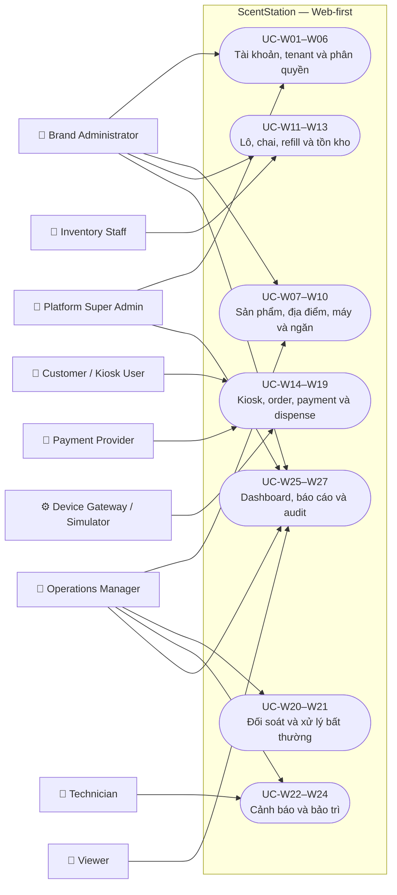
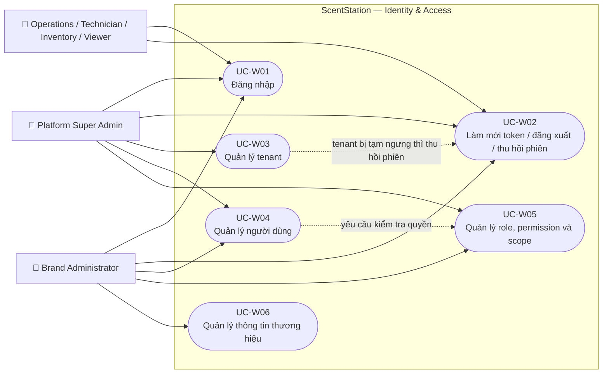
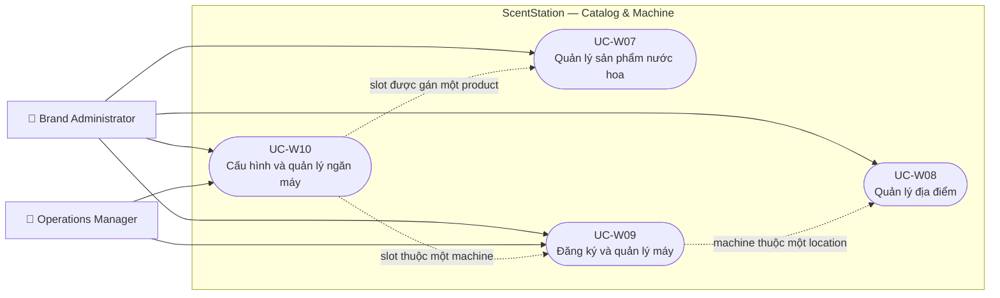
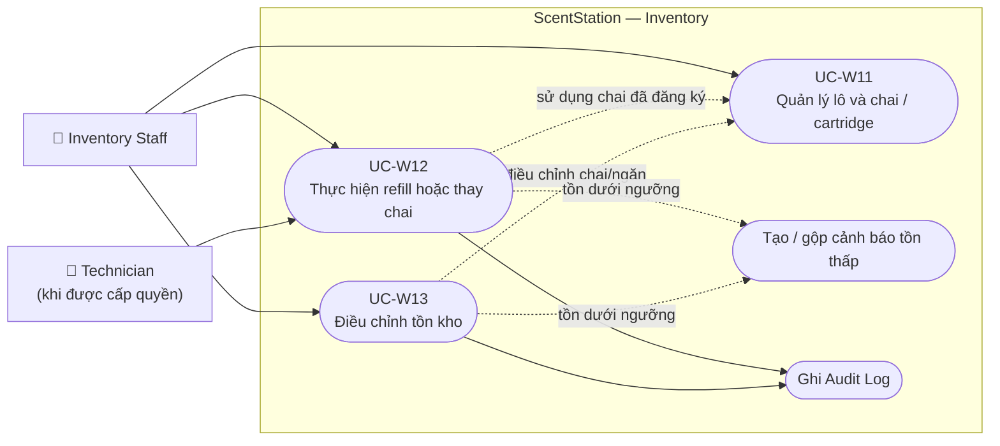
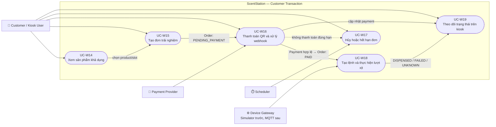
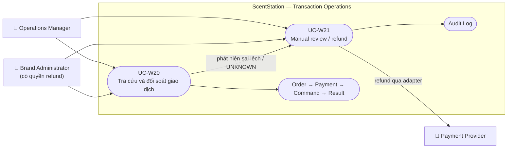
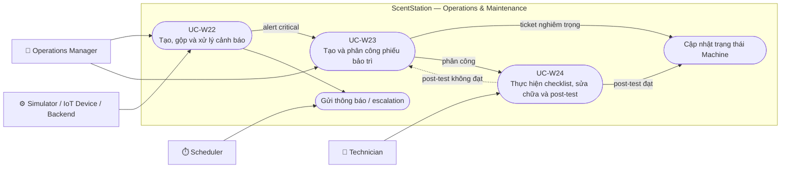
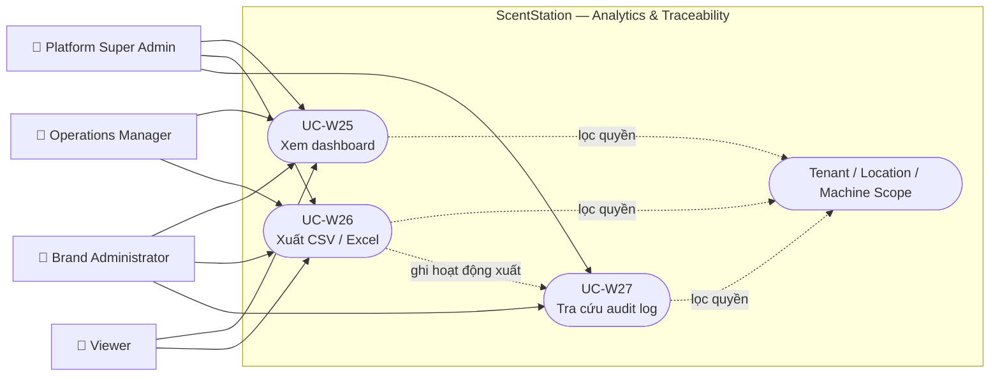
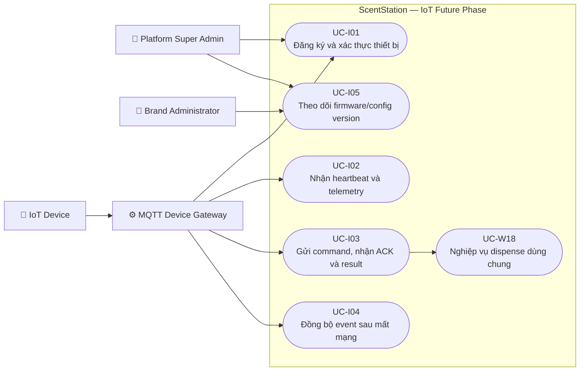

# MERMAID DIAGRAMS — SCENTSTATION USE CASE

Các khối dưới đây có thể chèn trực tiếp vào Markdown hỗ trợ Mermaid. Mermaid không có ký pháp UML Use Case gốc, vì vậy tài liệu dùng `flowchart` với actor ở ngoài và use case nằm trong `subgraph ScentStation`.

## 1. Use Case tổng quan Web-first

## 2. Authentication, tenant và RBAC

Ghi chú đối tượng:

- `Tenant`: không gian dữ liệu độc lập của một thương hiệu.
- `Role`: nhóm quyền, ví dụ Brand Admin hoặc Technician.
- `Permission`: hành động cụ thể, ví dụ `refund.create`.
- `Scope`: phạm vi áp dụng quyền: tenant, location hoặc machine.

## 3. Catalog, địa điểm, máy và ngăn

Ghi chú đối tượng:

- `Machine`: một kiosk vật lý hoặc máy mô phỏng có serial duy nhất.
- `MachineSlot`: một ngăn điều khiển độc lập trong machine.
- `FragranceProduct`: thông tin loại nước hoa; không phải chai vật lý.
- Một slot có thể cấu hình một product và tối đa một active bottle.

## 4. Tồn kho và refill

Ghi chú đối tượng:

- `InventoryBatch`: lô nhập kho của một sản phẩm.
- `Bottle`: chai/cartridge vật lý có mã duy nhất.
- `RefillSession`: lịch sử một lần tháo/lắp hoặc nạp/thay chai.
- `InventoryAdjustment`: thay đổi tồn thủ công, bắt buộc có lý do.

## 5. Kiosk, order, payment và dispense

Ghi chú đối tượng:

- `Order`: yêu cầu mua một lượt trải nghiệm, giữ snapshot giá và sản phẩm.
- `Payment`: kết quả giao dịch tài chính gắn với order.
- `PaymentEvent`: webhook dùng chống xử lý thông báo trùng.
- `DispenseCommand`: lệnh xịt duy nhất do backend tạo sau payment hợp lệ.
- `DispenseResult`: kết quả cuối do simulator hoặc thiết bị trả về.

## 6. Giao dịch bất thường và hoàn tiền

Quy tắc: `DISPENSE_UNKNOWN` chỉ được review; hệ thống không tự tạo lượt xịt thứ hai.

## 7. Cảnh báo và bảo trì

## 8. Dashboard, báo cáo và audit

## 9. Use Case IoT — triển khai sau Web-first

