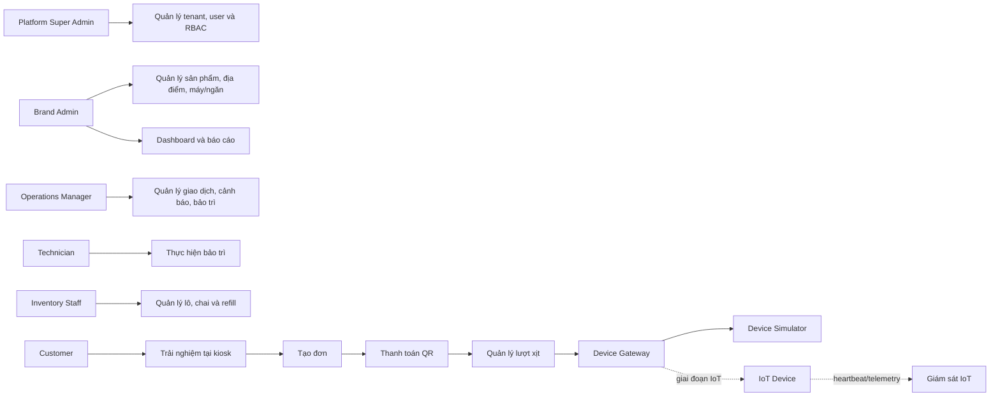

# USE CASE SPECIFICATION — SCENTSTATION

## 1. Thông tin và phạm vi

Tài liệu đặc tả use case của ScentStation được xây dựng từ `Phieu_FA26SE114.docx` và `BUSINESS_REQUIREMENTS_SCENTSTATION.md`.

- Use case có mã `UC-xxx`.
- Yêu cầu nguồn có mã `BR-xxx` và `RULE-xxx`.
- Nhóm `UC-Wxx` thuộc phạm vi Web-first.
- Nhóm `UC-Ixx` thuộc giai đoạn tích hợp IoT.

## 2. Tác nhân

| Mã | Tác nhân | Mô tả |
|---|---|---|
| ACT-01 | Platform Super Administrator | Quản lý toàn nền tảng và các tenant. |
| ACT-02 | Brand Administrator | Quản lý dữ liệu và người dùng trong một thương hiệu. |
| ACT-03 | Operations Manager | Theo dõi vận hành, giao dịch, cảnh báo và bảo trì. |
| ACT-04 | Technician | Chẩn đoán và xử lý phiếu bảo trì được giao. |
| ACT-05 | Inventory Staff | Quản lý lô, chai và refill. |
| ACT-06 | Viewer | Chỉ xem dashboard/báo cáo trong phạm vi được cấp. |
| ACT-07 | Customer/Kiosk User | Chọn, thanh toán và nhận lượt trải nghiệm. |
| ACT-08 | Payment Provider | Tạo QR và thông báo kết quả thanh toán. |
| ACT-09 | Device Gateway | Cổng trừu tượng giữa nghiệp vụ và simulator/MQTT. |
| ACT-10 | IoT Device | Máy vật lý thực hiện lệnh và gửi dữ liệu. |
| ACT-11 | Scheduler | Tác vụ nền hết hạn đơn, cảnh báo và escalation. |

### 2.1. Phạm vi trách nhiệm của từng tác nhân

| Tác nhân | Được làm | Không được làm |
|---|---|---|
| Platform Super Administrator | Quản lý tenant, Brand Admin, cấu hình toàn nền tảng, xem báo cáo/audit toàn hệ thống và thu hồi thiết bị | Không thực hiện nghiệp vụ khách hàng thay kiosk; không sửa/xóa lịch sử giao dịch đã phát sinh |
| Brand Administrator | Quản lý dữ liệu, nhân sự, sản phẩm, địa điểm, máy, giá và báo cáo của tenant mình | Không xem hoặc thay đổi tenant khác; không quản lý cấu hình cấp nền tảng |
| Operations Manager | Theo dõi máy, giao dịch, cảnh báo; tạo/phân công ticket; yêu cầu review/refund theo quyền | Không tự cấp quyền; không chỉnh tồn kho nếu không có quyền riêng |
| Technician | Xem máy/ticket được giao, bảo trì, diagnostic test, ghi kết quả và post-test | Không thay đổi giá, người dùng hoặc giao dịch thanh toán |
| Inventory Staff | Quản lý lô/chai, lắp/tháo/refill và điều chỉnh tồn kho theo quyền | Không xác nhận payment hoặc gửi lượt xịt khách hàng |
| Viewer | Xem dashboard và báo cáo trong phạm vi được cấp | Không tạo, cập nhật hoặc xử lý dữ liệu nghiệp vụ |
| Customer/Kiosk User | Xem sản phẩm, tạo đơn, thanh toán và theo dõi kết quả phiên của chính mình | Không đăng nhập cổng quản trị hoặc xem giao dịch của khách khác |
| Payment Provider | Phát hành dữ liệu QR/reference và gửi webhook kết quả | Không trực tiếp chuyển trạng thái order hoặc tạo lệnh xịt |
| Device Gateway | Chuyển command từ backend tới simulator/MQTT và chuyển ACK/result về backend | Không tự quyết định payment hợp lệ hoặc thay đổi quy tắc order |
| IoT Device | Kiểm tra command và điều kiện an toàn, thực hiện đúng một chu kỳ, gửi heartbeat/telemetry/result | Không tự tạo đơn hoặc xác nhận thanh toán |
| Scheduler | Thực thi tác vụ hệ thống theo thời gian/cấu hình | Không bỏ qua state machine và authorization của domain service |

### 2.2. Từ điển đối tượng nghiệp vụ

| Đối tượng | Định nghĩa | Ví dụ/trạng thái quan trọng |
|---|---|---|
| Tenant | Không gian dữ liệu độc lập của một thương hiệu nước hoa trên nền tảng | Dior Vietnam; `ACTIVE`, `SUSPENDED`, `DISABLED` |
| User | Tài khoản nhân sự sử dụng cổng quản trị; thuộc một tenant, trừ tài khoản cấp nền tảng | Brand Admin, Operations, Technician |
| Role | Nhóm quyền được gán cho user | `BRAND_ADMIN`, `OPERATIONS_MANAGER` |
| Permission | Quyền thao tác cụ thể được backend kiểm tra | `product.update`, `refund.create`, `inventory.adjust` |
| Scope | Phạm vi mà role/permission có hiệu lực | Toàn tenant, một location hoặc một machine |
| Location | Địa điểm vật lý đặt và vận hành máy | Trung tâm thương mại, cửa hàng, sự kiện |
| Fragrance Product | Mẫu sản phẩm nước hoa được kinh doanh/trải nghiệm | Tên, tầng hương, ảnh, giá mặc định |
| Machine | Một kiosk/máy trải nghiệm vật lý hoặc bản ghi máy mô phỏng | Có serial, location, trạng thái kết nối và chế độ vận hành |
| Machine Slot | Một ngăn điều khiển độc lập trong machine | Ngăn số 1 chứa một sản phẩm và tối đa một chai đang hoạt động |
| Inventory Batch | Một lô nhập kho của cùng sản phẩm | Số lô, ngày nhận, hạn sử dụng, số lượng |
| Bottle/Cartridge | Một chai/hộp cụ thể có mã định danh duy nhất | `AVAILABLE`, `INSTALLED`, `EMPTY`, `EXPIRED` |
| Refill Session | Một lần tháo chai cũ và lắp/nạp chai mới tại một slot | Người làm, thời gian, số đo trước/sau, chai cũ/mới |
| Inventory Adjustment | Bản ghi điều chỉnh lượng tồn thủ công, không phải refill hay dispense | Bắt buộc có giá trị trước/sau, lý do và người thực hiện |
| Order | Yêu cầu mua một lượt trải nghiệm tại một machine slot | Lưu snapshot sản phẩm, giá, tiền tệ và hạn thanh toán |
| Payment | Giao dịch thanh toán gắn với order | Reference, provider transaction ID, số tiền, trạng thái |
| Payment Event | Webhook/sự kiện nguyên bản do payment provider gửi | Có event ID/payload hash để chống xử lý trùng |
| Dispense Command | Lệnh backend yêu cầu đúng machine/slot thực hiện một lượt xịt | Command ID, token, chữ ký, hạn hiệu lực |
| Dispense Result | Kết quả cuối của một command | Thành công, thất bại hoặc dữ liệu lỗi/cảm biến liên quan |
| Diagnostic Dispense | Lượt xịt thử của kỹ thuật viên, không gắn với order khách hàng | Không tính doanh thu nhưng vẫn làm giảm lượng vật lý |
| Alert | Cảnh báo về một vấn đề vận hành cần theo dõi | Máy offline, tồn thấp, cửa mở, xịt lỗi |
| Maintenance Ticket | Phiếu quản lý vòng đời xử lý sự cố/bảo trì | Người phụ trách, ưu tiên, checklist, post-test |
| Audit Log | Nhật ký bất biến của hành động hoặc thay đổi nhạy cảm | Actor, tenant, hành động, đối tượng, before/after |
| Device Simulator | Thành phần giả lập phản hồi thiết bị trong Web-first | Giả lập ACK, success, failure, timeout, offline |
| Device Credential | Thông tin nhận diện/xác thực riêng của một máy vật lý | Certificate fingerprint, secret hash, trạng thái thu hồi |
| Heartbeat | Bản tin định kỳ chứng minh thiết bị còn kết nối | Dùng tính online/unstable/offline |
| Telemetry | Số đo/trạng thái thiết bị gửi về | Khối lượng, cửa, rò rỉ, nguồn, actuator |

### 2.3. Quan hệ giữa các đối tượng cốt lõi

```text
Tenant
 ├─ User ─ Role ─ Permission
 ├─ Location ─ Machine ─ MachineSlot
 │                         └─ active Bottle ─ InventoryBatch ─ FragranceProduct
 └─ FragranceProduct

Customer → Order → Payment → DispenseCommand → DispenseResult
                    │                              │
                    └─ PaymentEvent                └─ cập nhật Bottle/Slot tồn kho

Machine/Slot → Alert → MaintenanceTicket → MaintenanceActivity
Mọi thay đổi nhạy cảm → AuditLog
```

## 3. Sơ đồ use case tổng quan



## 4. Danh mục use case

| Mã | Use case | Tác nhân chính | Giai đoạn | Nguồn |
|---|---|---|---|---|
| UC-W01 | Đăng nhập | Người dùng nội bộ | Web-first | BR-020, BR-025 |
| UC-W02 | Quản lý phiên và đăng xuất | Người dùng nội bộ | Web-first | BR-023 |
| UC-W03 | Quản lý tenant | Platform Super Admin | Web-first | BR-011, BR-016 |
| UC-W04 | Quản lý người dùng | Platform/Brand Admin | Web-first | BR-012, BR-020 |
| UC-W05 | Quản lý vai trò và quyền | Platform/Brand Admin | Web-first | BR-021–BR-024 |
| UC-W06 | Quản lý thông tin thương hiệu | Brand Admin | Web-first | BR-015 |
| UC-W07 | Quản lý sản phẩm nước hoa | Brand Admin | Web-first | BR-030 |
| UC-W08 | Quản lý địa điểm | Brand Admin | Web-first | BR-031 |
| UC-W09 | Đăng ký và cấu hình máy | Brand Admin | Web-first | BR-032–BR-037 |
| UC-W10 | Quản lý ngăn máy | Brand Admin/Operations | Web-first | BR-034–BR-036 |
| UC-W11 | Quản lý lô và chai | Inventory Staff | Web-first | BR-070–BR-072 |
| UC-W12 | Thực hiện refill/thay chai | Inventory Staff | Web-first | BR-073–BR-078 |
| UC-W13 | Điều chỉnh tồn kho | Inventory Staff | Web-first | BR-077–BR-079 |
| UC-W14 | Xem danh sách nước hoa tại kiosk | Customer | Web-first | BR-040 |
| UC-W15 | Tạo đơn trải nghiệm | Customer | Web-first | BR-041, BR-050–BR-052 |
| UC-W16 | Thanh toán QR | Customer/Payment Provider | Web-first | BR-042–BR-055 |
| UC-W17 | Hết hạn hoặc hủy đơn | Scheduler/Customer | Web-first | BR-056–BR-058 |
| UC-W18 | Thực hiện lượt xịt | Backend/Device Gateway | Web-first + IoT | BR-061–BR-069 |
| UC-W19 | Theo dõi trạng thái trên kiosk | Customer | Web-first | BR-043–BR-047 |
| UC-W20 | Tra cứu và đối soát giao dịch | Operations | Web-first | BR-058–BR-060 |
| UC-W21 | Xử lý giao dịch bất thường | Operations | Web-first | BR-059, BR-069 |
| UC-W22 | Quản lý cảnh báo | Operations | Web-first | BR-080–BR-084 |
| UC-W23 | Quản lý phiếu bảo trì | Operations | Web-first | BR-084–BR-089 |
| UC-W24 | Thực hiện và đóng bảo trì | Technician | Web-first | BR-086–BR-089 |
| UC-W25 | Xem dashboard | Người dùng được cấp quyền | Web-first | BR-090–BR-093, BR-095 |
| UC-W26 | Xuất báo cáo | Người dùng được cấp quyền | Web-first | BR-092–BR-095 |
| UC-W27 | Tra cứu audit log | Quản trị viên được cấp quyền | Web-first | BR-096–BR-098 |
| UC-I01 | Đăng ký/xác thực thiết bị | Platform Admin/IoT Device | IoT | BR-032, BR-107 |
| UC-I02 | Nhận heartbeat và telemetry | IoT Device | IoT | BR-100–BR-102 |
| UC-I03 | Gửi và nhận kết quả command | Device Gateway/IoT Device | IoT | BR-103–BR-104 |
| UC-I04 | Đồng bộ sự kiện sau mất mạng | IoT Device | IoT | BR-105 |
| UC-I05 | Theo dõi firmware/configuration | Platform/Brand Admin | IoT | BR-106 |

## 5. Đặc tả use case Web-first

### 5.0. Hợp đồng vào/ra của từng use case

Bảng này làm rõ đối tượng mà từng use case đọc hoặc thay đổi. Các use case quan trọng có luồng chi tiết ở các mục tiếp theo.

| Use case | Dữ liệu vào | Xử lý/đối tượng bị thay đổi | Kết quả trả về | Ngoại lệ chính |
|---|---|---|---|---|
| UC-W01 Đăng nhập | Email, mật khẩu | User, RefreshSession, AuditLog | Token, hồ sơ, role/permission/scope | Sai mật khẩu, user/tenant bị khóa, rate limit |
| UC-W02 Quản lý phiên | Refresh token hoặc session ID | RefreshSession, AuditLog | Token mới hoặc xác nhận thu hồi | Token hết hạn, đã thu hồi, permission version cũ |
| UC-W03 Quản lý tenant | Code, tên, trạng thái, thông tin thương hiệu | Tenant, AuditLog | Tenant sau cập nhật | Trùng code; actor không phải Platform Admin |
| UC-W04 Quản lý user | Email, tên, tenant, trạng thái | User, RefreshSession, AuditLog | User sau cập nhật | Trùng email; khác tenant; cấp vượt quyền |
| UC-W05 Quản lý role/permission | Role, permission, scope, user | Role, UserRole, RolePermission, AuditLog | Ma trận quyền mới | Scope không hợp lệ; role/user khác tenant |
| UC-W06 Quản lý thương hiệu | Logo, mô tả, liên hệ, kiosk content | Tenant, AuditLog | Hồ sơ thương hiệu mới | Brand Admin sửa tenant khác |
| UC-W07 Quản lý sản phẩm | SKU, tên, mô tả, ảnh, tầng hương, giá | FragranceProduct, AuditLog | Sản phẩm sau cập nhật | Trùng SKU; giá âm; sản phẩm khác tenant |
| UC-W08 Quản lý địa điểm | Code, tên, địa chỉ, múi giờ | Location, AuditLog | Location sau cập nhật | Trùng code; location đang có machine khi vô hiệu hóa |
| UC-W09 Quản lý máy | Serial, tên, location, trạng thái | Machine, MachineStatusHistory, AuditLog | Machine sau cập nhật | Trùng serial; location khác tenant |
| UC-W10 Quản lý slot | Machine, số ngăn, product, giá, ngưỡng, liều lượng | MachineSlot, AuditLog | Cấu hình slot | Trùng số ngăn; product/chai khác tenant; giá âm |
| UC-W11 Quản lý lô/chai | Product, batch number, hạn dùng, bottle identifier, dung lượng | InventoryBatch, Bottle, AuditLog | Lô/chai được đăng ký | Trùng mã; sản phẩm khác tenant; hạn không hợp lệ |
| UC-W12 Refill/thay chai | Machine, slot, chai cũ/mới, số đo, ghi chú | Bottle, MachineSlot, RefillSession, AuditLog | Refill hoàn tất | Máy chưa maintenance; chai đang lắp nơi khác/hết hạn/sai sản phẩm |
| UC-W13 Điều chỉnh tồn | Bottle/slot, lượng mới, lý do | Bottle, MachineSlot, InventoryAdjustment, AuditLog | Tồn kho sau điều chỉnh | Thiếu quyền/lý do; lượng âm; conflict phiên bản |
| UC-W14 Xem catalog kiosk | Machine identity | Machine, MachineSlot, Product chỉ đọc | Danh sách slot/sản phẩm khả dụng | Máy offline/maintenance hoặc không được nhận diện |
| UC-W15 Tạo order | Machine, slot, idempotency key | Order, OrderStatusHistory | Order/reference/expiry | Slot không khả dụng; hết tồn; request trùng |
| UC-W16 Thanh toán QR | Order ID; webhook provider | Payment, PaymentEvent, Order, histories | QR/status payment | Sai chữ ký/reference/amount/currency; webhook trùng; đến muộn |
| UC-W17 Hủy/hết hạn order | Order ID hoặc thời điểm hiện tại | Order, OrderStatusHistory | Trạng thái `CANCELLED`/`EXPIRED` | Order đã paid hoặc đã ở trạng thái cuối |
| UC-W18 Thực hiện dispense | Order paid hoặc yêu cầu diagnostic hợp lệ | DispenseCommand, Result, Order, Bottle, Slot, Alert | Trạng thái dispense cuối | Command trùng/hết hạn; unsafe; timeout; kết quả không rõ |
| UC-W19 Theo dõi kiosk | Order ID + kiosk session | Chỉ đọc order/payment/dispense | Event trạng thái và hướng dẫn UI | Session/order không hợp lệ; mất kết nối; timeout |
| UC-W20 Tra cứu/đối soát | Bộ lọc, provider report/reference | Order, Payment, Event, Command, Result chỉ đọc | Danh sách và timeline sai lệch | Ngoài scope; dữ liệu provider chưa có |
| UC-W21 Xử lý bất thường | Order, action, lý do, bằng chứng | Order, Payment, Alert, AuditLog | Manual-review/refund status | Thiếu quyền; kết quả xịt chưa chắc chắn; refund trùng |
| UC-W22 Quản lý alert | Alert data/action/assignee | Alert, Notification, có thể Ticket | Alert sau xử lý | Alert trùng được gộp; transition sai; khác tenant |
| UC-W23 Quản lý ticket | Machine/alert, ưu tiên, assignee, due date | MaintenanceTicket, Activity, Machine | Ticket được tạo/phân công | Machine/user khác tenant; ticket critical đang mở |
| UC-W24 Thực hiện bảo trì | Ticket, checklist, chẩn đoán, ảnh, post-test | Ticket, Activity, Machine, AuditLog | Ticket đóng hoặc tiếp tục xử lý | Chưa đủ checklist; post-test fail; technician không được giao |
| UC-W25 Dashboard | Thời gian và bộ lọc scope | Dữ liệu tổng hợp chỉ đọc | KPI/biểu đồ | Bộ lọc ngoài quyền; khoảng thời gian không hợp lệ |
| UC-W26 Xuất báo cáo | Loại báo cáo, bộ lọc, định dạng | Job/file report, AuditLog | CSV/Excel hoặc trạng thái job | Không có quyền; dữ liệu quá lớn; job thất bại |
| UC-W27 Tra cứu audit | Bộ lọc actor/action/target/time | AuditLog chỉ đọc | Danh sách audit | User thường; filter ngoài tenant; không cho sửa/xóa |

### UC-W01 — Đăng nhập

| Thuộc tính | Nội dung |
|---|---|
| Tác nhân | ACT-01 đến ACT-06 |
| Tiền điều kiện | Tài khoản tồn tại và đang hoạt động. |
| Kích hoạt | Người dùng gửi định danh và mật khẩu. |
| Hậu điều kiện thành công | Access token ngắn hạn và refresh session được tạo. |
| Nguồn | BR-020, BR-025, NFR-004, NFR-005 |

Luồng chính:

1. Người dùng nhập thông tin đăng nhập.
2. Hệ thống kiểm tra định dạng và giới hạn tần suất.
3. Hệ thống xác minh tài khoản và mật khẩu.
4. Hệ thống kiểm tra tenant và trạng thái tài khoản.
5. Hệ thống tạo access token và refresh session.
6. Hệ thống ghi authentication event và trả về phạm vi quyền.

Ngoại lệ:

- Sai thông tin: trả lỗi chung, không tiết lộ tài khoản có tồn tại.
- Tài khoản/tenant bị khóa: từ chối và ghi audit.
- Vượt giới hạn: tạm thời từ chối yêu cầu.

### UC-W02 — Làm mới token, xem và thu hồi phiên

| Thuộc tính | Nội dung |
|---|---|
| Tác nhân | ACT-01 đến ACT-06 |
| Tiền điều kiện | Có refresh session chưa hết hạn và chưa bị thu hồi. |
| Hậu điều kiện | Token được xoay vòng hoặc session được đánh dấu thu hồi. |
| Nguồn | BR-023, NFR-005 |

Luồng làm mới:

1. Client gửi refresh token.
2. Backend chỉ so sánh token sau khi băm với `RefreshSession.token_hash`.
3. Kiểm tra thời hạn, `revoked_at`, trạng thái user/tenant và `permission_version`.
4. Thu hồi token cũ, phát hành cặp token mới và cập nhật `last_used_at`.

Luồng đăng xuất/thu hồi:

1. Người dùng đăng xuất một phiên hoặc quản trị viên thu hồi phiên của user.
2. Backend đặt `revoked_at` và ghi audit.
3. Token cũ không thể được làm mới.

### UC-W03 — Quản lý tenant

| Thuộc tính | Nội dung |
|---|---|
| Tác nhân | ACT-01 |
| Tiền điều kiện | Platform Super Admin đã đăng nhập. |
| Hậu điều kiện | Tenant được tạo/cập nhật/kích hoạt/tạm ngưng và có audit log. |
| Nguồn | BR-011, BR-016, RULE-014 |

Luồng chính:

1. Quản trị viên xem danh sách tenant.
2. Tạo hoặc cập nhật thông tin thương hiệu.
3. Hệ thống kiểm tra mã tenant duy nhất.
4. Hệ thống lưu thay đổi và audit log.

Luồng thay thế:

- Tạm ngưng tenant: phiên người dùng thuộc tenant bị thu hồi và thao tác nghiệp vụ mới bị chặn.
- Kích hoạt lại: người có quyền được phép truy cập lại; phiên cũ không tự khôi phục.

### UC-W04 — Quản lý người dùng

| Thuộc tính | Nội dung |
|---|---|
| Tác nhân | ACT-01, ACT-02 |
| Tiền điều kiện | Có quyền quản lý người dùng trong phạm vi mục tiêu. |
| Hậu điều kiện | Tài khoản và quyền được cập nhật, phiên không còn hợp lệ được thu hồi. |
| Nguồn | BR-012, BR-020–BR-025, RULE-014, RULE-018 |

Luồng chính:

1. Quản trị viên chọn người dùng hoặc tạo mới.
2. Nhập thông tin và gán vai trò/phạm vi.
3. Backend cưỡng chế cùng tenant đối với Brand Admin.
4. Lưu thay đổi và ghi audit.
5. Thu hồi session khi tài khoản bị khóa hoặc vô hiệu hóa.

### UC-W05 — Quản lý vai trò và quyền

| Thuộc tính | Nội dung |
|---|---|
| Tác nhân | ACT-01, ACT-02 |
| Tiền điều kiện | Actor có quyền quản lý role và không cấp quyền cao hơn chính mình. |
| Hậu điều kiện | Role/permission/scope được cập nhật; permission version tăng; phiên cũ không còn hiệu lực. |
| Nguồn | BR-021–BR-025, RULE-014, RULE-018 |

Luồng chính:

1. Quản trị viên tạo/chọn role trong tenant.
2. Chọn permission và phạm vi tenant/location/machine.
3. Gán role cho user.
4. Backend kiểm tra role, user và scope cùng tenant.
5. Backend ngăn actor cấp platform permission hoặc quyền vượt quá thẩm quyền.
6. Lưu mapping, tăng `permission_version`, thu hồi session cần thiết và ghi audit.

### UC-W06 — Quản lý thông tin thương hiệu

| Thuộc tính | Nội dung |
|---|---|
| Tác nhân | ACT-02 |
| Tiền điều kiện | Brand Admin đã đăng nhập và tenant đang active. |
| Hậu điều kiện | Thông tin thương hiệu/kiosk được cập nhật và có audit. |
| Nguồn | BR-015, BR-016, RULE-014 |

Brand Admin cập nhật logo, mô tả, liên hệ và nội dung kiosk của chính tenant. Backend bỏ qua mọi `tenant_id` do client tự truyền và lấy tenant từ authenticated context. Dữ liệu được validate, lưu vào `Tenant` và ghi `AuditLog`.

### UC-W07 — Quản lý sản phẩm nước hoa

| Thuộc tính | Nội dung |
|---|---|
| Tác nhân | ACT-02 |
| Tiền điều kiện | Brand Admin có quyền quản lý catalog. |
| Hậu điều kiện | Sản phẩm thuộc tenant được tạo/cập nhật/ngừng kinh doanh. |
| Nguồn | BR-030, RULE-004, RULE-013 |

Luồng chính:

1. Xem danh sách sản phẩm trong tenant.
2. Tạo/cập nhật tên, mô tả, tầng hương, ảnh và giá mặc định.
3. Hệ thống kiểm tra dữ liệu và tiền tệ.
4. Hệ thống lưu dữ liệu và audit thay đổi giá/trạng thái.

Quy tắc: thay đổi giá sản phẩm không thay đổi giá snapshot của đơn đã tạo.

### UC-W08 — Quản lý địa điểm

| Thuộc tính | Nội dung |
|---|---|
| Tác nhân | ACT-02 |
| Tiền điều kiện | Brand Admin có quyền quản lý location trong tenant. |
| Hậu điều kiện | Location được tạo/cập nhật/vô hiệu hóa và có audit. |
| Nguồn | BR-031, BR-016, RULE-014 |

Brand Admin tạo/cập nhật/vô hiệu hóa `Location` trong tenant. Mã location phải duy nhất trong tenant. Trước khi vô hiệu hóa, hệ thống hiển thị số `Machine` đang gắn; machine phải được di chuyển hoặc vô hiệu hóa theo quyết định có quyền, không tự động mất liên kết.

### UC-W09 — Đăng ký và quản lý máy

| Thuộc tính | Nội dung |
|---|---|
| Tác nhân | ACT-02, ACT-03 |
| Tiền điều kiện | Tenant và địa điểm tồn tại. |
| Hậu điều kiện | Máy/ngăn được cấu hình và có lịch sử thay đổi. |
| Nguồn | BR-031–BR-037, RULE-001–RULE-003 |

Luồng chính:

1. Brand Admin đăng ký máy bằng serial number duy nhất trong tenant.
2. Gán máy vào địa điểm.
3. Chọn trạng thái/chế độ ban đầu; trong Web-first có thể bật simulator.
4. Bật/tắt hoặc chuyển maintenance theo quyền.
5. Hệ thống ghi status history và audit.

### UC-W10 — Quản lý ngăn máy

| Thuộc tính | Nội dung |
|---|---|
| Tác nhân | ACT-02, ACT-03 theo quyền |
| Tiền điều kiện | Machine tồn tại trong tenant; product/chai tham chiếu cùng tenant. |
| Hậu điều kiện | Slot có cấu hình hợp lệ và lịch sử/audit tương ứng. |
| Nguồn | BR-034–BR-036, RULE-002, RULE-003, RULE-013 |

Luồng chính:

1. Khai báo số ngăn độc lập, tối thiểu bốn ngăn cho prototype.
2. Chọn một slot và gán product, giá, currency, ngưỡng và liều lượng.
3. Nếu kích hoạt, backend kiểm tra product active, một active bottle đúng product và đủ tồn.
4. Lưu cấu hình bằng optimistic version để tránh ghi đè đồng thời.
5. Bật/tắt slot theo quyền và ghi audit.

Ngoại lệ: không cho phép ngăn hoạt động nếu thiếu sản phẩm, chai đang hoạt động, giá hợp lệ hoặc đủ tồn kho.

### UC-W11 — Quản lý lô và chai

| Thuộc tính | Nội dung |
|---|---|
| Tác nhân | ACT-05 |
| Tiền điều kiện | Sản phẩm tồn tại trong cùng tenant. |
| Hậu điều kiện | Lô/chai được tạo và có trạng thái vòng đời hợp lệ. |
| Nguồn | BR-070–BR-072 |

Luồng chính:

1. Tạo lô với mã lô, ngày nhận và hạn dùng.
2. Đăng ký từng chai bằng mã duy nhất.
3. Ghi dung lượng/khối lượng ban đầu và khối lượng chai rỗng nếu có.
4. Hệ thống đặt chai ở trạng thái `AVAILABLE`.

### UC-W12 — Thực hiện refill/thay chai

| Thuộc tính | Nội dung |
|---|---|
| Tác nhân | ACT-05; ACT-04 hỗ trợ theo phân quyền |
| Tiền điều kiện | Máy ở maintenance; ngăn và chai cùng tenant; chai mới khả dụng, chưa hết hạn. |
| Hậu điều kiện | Chai cũ được tháo, chai mới được gán; lịch sử và audit được ghi nguyên tử. |
| Nguồn | BR-072–BR-078, RULE-002, RULE-013 |

Luồng chính:

1. Nhân viên chọn máy và ngăn.
2. Hệ thống chuyển/xác nhận máy ở maintenance.
3. Xác minh sản phẩm, lô, hạn dùng và mã chai mới.
4. Ghi số đo trước thao tác.
5. Tháo chai cũ và lắp chai mới.
6. Ghi số đo sau thao tác và ghi chú.
7. Hệ thống cập nhật liên kết active bottle, trạng thái chai và refill history trong một transaction.
8. Ghi audit; máy chỉ trở lại hoạt động sau kiểm tra cần thiết.

### UC-W13 — Điều chỉnh tồn kho

| Thuộc tính | Nội dung |
|---|---|
| Tác nhân | ACT-05 có quyền điều chỉnh |
| Tiền điều kiện | Chai/ngăn thuộc tenant và lý do được cung cấp. |
| Hậu điều kiện | Giá trị tồn thay đổi, lịch sử điều chỉnh và audit được ghi. |
| Nguồn | BR-077–BR-079, RULE-013, RULE-018 |

Luồng chính:

1. Inventory Staff tìm chai hoặc slot cần điều chỉnh.
2. Hệ thống hiển thị lượng hiện tại và nguồn xác định gần nhất.
3. Người dùng nhập lượng thực tế mới và lý do bắt buộc.
4. Backend kiểm tra quyền `inventory.adjust`, tenant và giá trị không âm.
5. Backend khóa bản ghi hoặc kiểm tra `version` để tránh ghi đè.
6. Trong một transaction, cập nhật lượng chai/slot, tạo `InventoryAdjustment` và `AuditLog`.
7. Nếu lượng dưới ngưỡng, cập nhật slot và tạo/gộp low-stock alert.

Ngoại lệ: nếu dữ liệu đã bị người khác thay đổi, trả conflict và yêu cầu tải lại; không tự ghi đè.

### UC-W14 — Xem sản phẩm tại kiosk

| Thuộc tính | Nội dung |
|---|---|
| Tác nhân | ACT-07 |
| Tiền điều kiện | Kiosk được gắn với máy; máy và backend giao tiếp được. |
| Hậu điều kiện | Danh sách sản phẩm/slot khả dụng được hiển thị; chưa tạo Order. |
| Nguồn | BR-040, RULE-003, RULE-010 |

Luồng chính UC-W14:

1. Kiosk yêu cầu danh sách sản phẩm khả dụng của máy.
2. Khách xem và chọn một sản phẩm.
3. Backend chỉ trả slot active, có product active, giá hợp lệ, chai đang lắp và đủ tồn.
4. Kiosk hiển thị thông tin, giá và hướng dẫn của product.

### UC-W15 — Tạo đơn trải nghiệm

| Thuộc tính | Nội dung |
|---|---|
| Tác nhân | ACT-07 |
| Tiền điều kiện | Khách đã chọn slot từ UC-W14; machine/backend còn giao tiếp. |
| Hậu điều kiện | Order `PENDING_PAYMENT` có snapshot, idempotency key và expiry. |
| Nguồn | BR-041, BR-050–BR-052, RULE-003, RULE-004, RULE-010 |

Luồng chính UC-W15:

1. Kiosk hiển thị lại product và giá để khách xác nhận.
2. Kiosk gửi machine, slot và idempotency key.
3. Backend khóa/kiểm tra ngắn hạn trạng thái machine, slot, product và tồn kho.
4. Backend tạo order với snapshot tenant, machine, slot, product, giá và currency.
5. Backend đặt hạn thanh toán, tạo payment reference và status history.
6. Trả order ID/reference/expiry để chuyển sang UC-W16.

Ngoại lệ: nếu máy/ngăn không còn khả dụng tại bước 4, không tạo đơn và yêu cầu khách chọn lại.

### UC-W16 — Thanh toán QR

| Thuộc tính | Nội dung |
|---|---|
| Tác nhân | ACT-07, ACT-08 |
| Tiền điều kiện | Đơn đang `PENDING_PAYMENT` và chưa hết hạn. |
| Hậu điều kiện | Payment được ghi; đơn chuyển `PAID` đúng một lần hoặc trạng thái thất bại phù hợp. |
| Nguồn | BR-042, BR-043, BR-052–BR-055, RULE-005–RULE-007, RULE-017 |

Luồng chính:

1. Backend tạo yêu cầu thanh toán qua payment adapter.
2. Kiosk hiển thị QR.
3. Payment Provider gửi webhook.
4. Backend xác minh chữ ký, reference, số tiền, currency và trạng thái.
5. Backend ghi payment event duy nhất.
6. Trong transaction, backend cập nhật payment/order sang thành công đúng một lần.
7. Backend kích hoạt quy trình tạo dispense command.

Ngoại lệ:

- Webhook trùng: trả thành công idempotent, không lặp nghiệp vụ.
- Sai chữ ký/số tiền: từ chối, ghi sự kiện bảo mật.
- Payment đến sau khi đơn hết hạn: chuyển manual review theo chính sách, không tự động xịt.

### UC-W17 — Hết hạn hoặc hủy đơn

| Thuộc tính | Nội dung |
|---|---|
| Tác nhân | ACT-07, ACT-11 |
| Tiền điều kiện | Order đang `PENDING_PAYMENT`. |
| Hậu điều kiện | Order chuyển `CANCELLED` hoặc `EXPIRED`, có status history và không có dispense command. |
| Nguồn | BR-056–BR-058, RULE-017 |

Luồng hết hạn:

1. Scheduler tìm order `PENDING_PAYMENT` có `expires_at <= now()`.
2. Khóa từng order và kiểm tra lại trạng thái.
3. Chuyển sang `EXPIRED` và ghi history.
4. Payment đến muộn được ghi nhận nhưng chuyển manual review, không tự tạo command.

Luồng hủy:

1. Kiosk yêu cầu hủy order trong phiên hiện tại.
2. Backend xác minh order vẫn đang chờ và thuộc đúng machine/session.
3. Chuyển `CANCELLED`, hủy payment request nếu provider hỗ trợ và ghi history.

### UC-W18 — Thực hiện lượt xịt

| Thuộc tính | Nội dung |
|---|---|
| Tác nhân | Backend, ACT-09, sau này ACT-10 |
| Tiền điều kiện | Đơn `PAID`; chưa có lệnh hiệu lực; máy/ngăn đủ điều kiện. |
| Hậu điều kiện | Đơn `DISPENSED`, `DISPENSE_FAILED` hoặc `DISPENSE_UNKNOWN`; result và history được ghi. |
| Nguồn | BR-061–BR-069, RULE-007–RULE-012, RULE-015, RULE-017 |

Luồng chính:

1. Dispense service kiểm tra order `PAID` và điều kiện máy/ngăn.
2. Tạo command ID/token duy nhất, hạn hiệu lực và chữ ký.
3. Database constraint bảo đảm một order không có command thứ hai.
4. Gửi command qua `DeviceGateway`.
5. Gateway trả ACK.
6. Thiết bị/simulator kiểm tra command và điều kiện an toàn.
7. Thiết bị thực hiện đúng một chu kỳ và trả result.
8. Backend lưu result idempotent.
9. Nếu thành công, cập nhật order `DISPENSED` và tồn kho trong transaction.
10. Kiosk nhận trạng thái cuối.

Ngoại lệ:

- Từ chối an toàn hoặc lỗi xác định: `DISPENSE_FAILED`.
- Không có kết quả chắc chắn trước timeout: `DISPENSE_UNKNOWN` và manual review.
- Gửi lại: dùng cùng command ID; thiết bị không thực hiện lại command đã xử lý.

### UC-W19 — Theo dõi trạng thái trên kiosk

| Thuộc tính | Nội dung |
|---|---|
| Tác nhân | ACT-07 |
| Tiền điều kiện | Kiosk có order ID và access token/nonce giới hạn cho order đó. |
| Hậu điều kiện | Khách nhìn thấy trạng thái đúng; phiên được xóa khỏi màn hình sau khi kết thúc. |
| Nguồn | BR-043–BR-047 |

Luồng chính:

1. Kiosk đăng ký SSE theo order hoặc polling endpoint trạng thái.
2. Backend chỉ trả trạng thái của order được nonce cho phép.
3. `PENDING_PAYMENT`: hiển thị QR và thời gian còn lại.
4. `PAID/DISPENSING`: ẩn QR, hướng dẫn đặt giấy/cổ tay và hiển thị đang xử lý.
5. `DISPENSED`: thông báo thành công và hiển thị QR sản phẩm nếu có.
6. `FAILED/UNKNOWN/REFUND_*`: hiển thị hướng dẫn liên hệ/xử lý, không hứa tự xịt lại.
7. Sau thời gian cấu hình, xóa dữ liệu phiên tại UI và về màn hình chính.

Ngoại lệ: khi SSE mất kết nối, chuyển polling có backoff; không tạo lại order chỉ vì mất kết nối UI.

### UC-W20 — Tra cứu và đối soát giao dịch

| Thuộc tính | Nội dung |
|---|---|
| Tác nhân | ACT-03; ACT-02 theo quyền |
| Tiền điều kiện | Người dùng có quyền trong tenant/phạm vi máy. |
| Hậu điều kiện | Danh sách, timeline và sai lệch đối soát được hiển thị; chưa thay đổi giao dịch. |
| Nguồn | BR-058–BR-060 |

Luồng chính:

1. Tìm kiếm theo thời gian, máy, địa điểm, sản phẩm, reference hoặc trạng thái.
2. Xem timeline order–payment–command–result.
3. So sánh payment nội bộ với event/provider record.
4. Hiển thị sai lệch số tiền, trạng thái, thiếu event hoặc payment không khớp order.

### UC-W21 — Xử lý giao dịch bất thường

| Thuộc tính | Nội dung |
|---|---|
| Tác nhân | ACT-03; ACT-02 theo quyền nhạy cảm |
| Tiền điều kiện | Order thuộc scope và đang ở trạng thái cần review/refund. |
| Hậu điều kiện | Quyết định, lý do, payment/order status và audit được lưu. |
| Nguồn | BR-059, BR-069, RULE-013, RULE-015, RULE-018 |

Luồng chính:

1. Mở transaction timeline từ UC-W20.
2. Chọn manual review hoặc refund khi đủ quyền.
3. Ghi lý do và bằng chứng.
4. Với kết quả `UNKNOWN`, không tạo command mới; yêu cầu xác minh thực tế/provider.
5. Hệ thống gọi refund adapter mock/sandbox idempotently nếu được duyệt.
6. Cập nhật trạng thái, history và audit.

### UC-W22 — Quản lý cảnh báo

| Thuộc tính | Nội dung |
|---|---|
| Tác nhân | ACT-03, ACT-11, ACT-09/ACT-10 |
| Tiền điều kiện | Nguồn phát hiện vấn đề cung cấp tenant, machine, loại và severity. |
| Hậu điều kiện | Alert mới được tạo hoặc alert đang mở được gộp; người chịu trách nhiệm được thông báo. |
| Nguồn | BR-080–BR-084 |

Luồng tạo/gộp:

1. Hệ thống tạo `deduplication_key` từ tenant, machine/slot và loại lỗi.
2. Tìm alert chưa đóng có cùng key.
3. Nếu có, tăng `occurrence_count` và cập nhật `last_occurred_at`.
4. Nếu chưa có, tạo alert mới và notification.
5. Nếu severity/type đạt cấu hình critical, tạo một maintenance ticket liên kết.

Luồng xử lý:

1. Operations acknowledge và nhận/phân công alert.
2. Ghi nội dung xử lý.
3. Resolve khi nguyên nhân đã được xử lý; có thể reopen nếu lỗi tái diễn.
4. Scheduler escalation alert quá SLA và gửi thông báo.

### UC-W23 — Tạo và quản lý phiếu bảo trì

| Thuộc tính | Nội dung |
|---|---|
| Tác nhân | ACT-03, ACT-04 |
| Tiền điều kiện | Ticket thuộc phạm vi; technician được phân công. |
| Hậu điều kiện | Ticket có đầy đủ kết quả; máy chỉ active lại sau post-test đạt yêu cầu. |
| Nguồn | BR-084–BR-089, RULE-009, RULE-016 |

Luồng chính UC-W23:

1. Operations tạo/phân công ticket.
2. Máy chuyển maintenance nếu sự cố yêu cầu.
3. Thiết lập category, severity, priority, due date và technician cùng tenant/scope.
4. Mỗi thay đổi assignee/status được ghi `MaintenanceActivity`.

### UC-W24 — Thực hiện và đóng bảo trì

| Thuộc tính | Nội dung |
|---|---|
| Tác nhân | ACT-04 |
| Tiền điều kiện | Ticket được giao; machine ở maintenance khi yêu cầu. |
| Hậu điều kiện | Kết quả sửa chữa đầy đủ; ticket đóng và machine active nếu post-test đạt. |
| Nguồn | BR-086–BR-089, RULE-009, RULE-016 |

Luồng chính UC-W24:

1. Technician tiếp nhận và thực hiện checklist.
2. Ghi chẩn đoán, biện pháp, linh kiện, chi phí, ghi chú và bằng chứng.
3. Thực hiện diagnostic dispense nếu được cấp quyền; ghi riêng với lượt khách.
4. Thực hiện post-maintenance test.
5. Nếu đạt, đóng ticket và cho phép machine active lại.
6. Nếu không đạt, giữ ticket/machine ở trạng thái xử lý và ghi nguyên nhân.

### UC-W25/W26 — Dashboard và báo cáo

#### UC-W25 — Xem dashboard

1. Người dùng chọn khoảng thời gian và bộ lọc được phép.
2. Backend xây tenant/scope predicate từ token, không tin `tenant_id` từ UI.
3. Hệ thống tổng hợp số máy theo trạng thái, doanh thu, trạng thái order/payment, tỷ lệ dispense, sản phẩm phổ biến, tồn kho, alert và maintenance.
4. Trả số liệu kèm múi giờ, đơn vị và thời điểm cập nhật.
5. Platform Super Admin có endpoint/view toàn nền tảng riêng.

Ngoại lệ: filter ngoài scope trả `403`; khoảng thời gian quá lớn được giới hạn hoặc chuyển background job.

#### UC-W26 — Xuất báo cáo

1. Người dùng chọn loại báo cáo, cột, thời gian, filter và CSV/Excel.
2. Backend kiểm tra permission xuất và scope.
3. Báo cáo nhỏ được tạo trực tiếp; báo cáo lớn tạo background job.
4. File có thời hạn tải xuống và chỉ người được phép truy cập.
5. Audit log ghi người xuất, loại báo cáo, bộ lọc và thời gian.

### UC-W27 — Tra cứu audit log

| Thuộc tính | Nội dung |
|---|---|
| Tác nhân | ACT-01; ACT-02 được cấp quyền |
| Tiền điều kiện | Có permission xem audit trong scope tương ứng. |
| Hậu điều kiện | Không thay đổi dữ liệu; kết quả truy vấn được phân trang. |
| Nguồn | BR-096–BR-098 |

Luồng chính:

1. Chọn khoảng thời gian, actor, action, target hoặc severity.
2. Backend áp dụng tenant/scope.
3. Trả actor, thời gian, nguồn, đối tượng và before/after được che dữ liệu nhạy cảm.
4. Người dùng có thể đi từ audit record tới đối tượng nguồn nếu còn quyền.

Không cung cấp API update/delete audit cho application role. Secret, password hash, token và payment credential không được ghi vào before/after.

## 6. Đặc tả use case IoT cấp cao

### UC-I01 — Đăng ký và xác thực thiết bị

Platform Admin đăng ký device identity và credential riêng. Gateway chỉ chấp nhận thiết bị đang hoạt động, đúng identity và chưa bị thu hồi.

### UC-I02 — Nhận heartbeat và telemetry

Thiết bị gửi heartbeat/telemetry có event ID và thời điểm đo. Backend cập nhật trạng thái hiện tại, lưu dữ liệu cần thiết, phát hiện timeout và tạo cảnh báo phù hợp.

### UC-I03 — Gửi và nhận kết quả command

MQTT adapter triển khai cùng `DeviceGateway` contract với simulator. Command, ACK và result được liên kết bằng command ID, xử lý idempotent và tuân thủ UC-W18.

### UC-I04 — Đồng bộ sau mất mạng

Thiết bị lưu event chưa gửi và đồng bộ lại bằng event ID duy nhất. Backend bỏ qua event đã xử lý và giữ thời điểm phát sinh gốc.

### UC-I05 — Theo dõi firmware/configuration

Backend lưu firmware/configuration version hiện tại, lịch sử thay đổi và trạng thái đồng bộ. OTA hoàn chỉnh thuộc phạm vi nâng cao.

## 7. Ma trận actor–use case

| Nhóm | Use case chính |
|---|---|
| Platform Super Admin | UC-W01–W05, W09, W25–W27, UC-I01, UC-I05 |
| Brand Admin | UC-W01–W13, W20–W27 |
| Operations Manager | UC-W01, W09–W10, W20–W25 |
| Technician | UC-W01, W12, W24 |
| Inventory Staff | UC-W01, W11–W13, W26 |
| Viewer | UC-W01, W25–W26 |
| Customer | UC-W14–W19 |
| Payment Provider | UC-W16 |
| Device Gateway/Device | UC-W18, UC-I01–I05 |

## 8. Ma trận truy vết BR–UC cấp cao

| Nhóm Business Requirement | Use case |
|---|---|
| BR-011–BR-016 | UC-W03, UC-W04, UC-W06 |
| BR-020–BR-025 | UC-W01, UC-W02, UC-W04, UC-W05 |
| BR-030–BR-037 | UC-W07–UC-W10 |
| BR-040–BR-048 | UC-W14–UC-W19 |
| BR-050–BR-060 | UC-W15–UC-W17, UC-W20, UC-W21 |
| BR-061–BR-069 | UC-W18–UC-W21, UC-I03 |
| BR-070–BR-079 | UC-W11–UC-W13, UC-W26 |
| BR-080–BR-089 | UC-W22–UC-W24, UC-W25 |
| BR-090–BR-098 | UC-W20, UC-W25–UC-W27 |
| BR-100–BR-107 | UC-I01–UC-I05 |

## 9. Ưu tiên use case Web MVP

- **P0:** UC-W01–W10, UC-W14–W21, UC-W27.
- **P1:** UC-W11–W13, UC-W22–W26.
- **IoT tiếp theo:** UC-I01–I05, dùng lại UC-W18.
