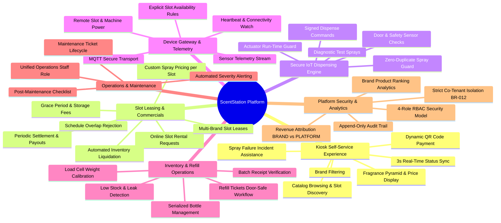
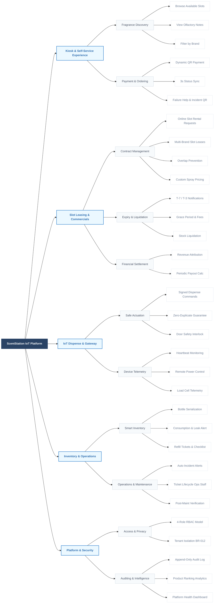

# 6.1 Major Features

[Include a numbered list of the major features of the new product, emphasizing those features that distinguish it from previous or competing products. Specific user requirements and functional requirements may be traced back to these features.]

---

## I. Numbered List of Major Features

* **FE-01: Autonomous Kiosk Fragrance Discovery and Self-Service Ordering**  
  Customers can independently browse active perfume slots on an interactive touchscreen kiosk, view detailed fragrance olfactory profiles (top, heart, and base notes), filter by brand, and create trial spray orders without requiring physical on-site sales staff.  
  *(Traces: BR-001, BR-011 · FR-ORD-01, FR-ORD-02, FR-ORD-03, FR-ORD-04)*

* **FE-02: Dynamic QR Payment and Real-Time Order Synchronization**  
  Generates dynamic, single-use QR payment codes linked to uniquely generated orders, verifies payment provider webhooks using cryptographic signatures (HMAC-SHA256) and idempotency guards, and updates transaction status on the kiosk screen within 3 seconds.  
  *(Traces: BR-001, BR-002, BR-008 · FR-ORD-07, FR-ORD-08, FR-ORD-09, FR-ORD-11, FR-ORD-13, FR-ORD-14, FR-ORD-15)*

* **FE-03: Multi-Brand Shared Slot Leasing and Online Rental Requests**  
  Enables fragrance brands to browse vacant slots and submit online lease requests, supports platform-managed multi-brand slot sharing on unified physical kiosks, enforces strict single-active-lease occupancy, schedule overlap rejection, and automated lease lifecycle state machine transitions (`DRAFT` → `ACTIVE` → `EXPIRING` → `GRACE` → `RENEWED` / `LIQUIDATED` → `CLOSED`).  
  *(Traces: BR-003, BR-009, BR-011, BR-013 · FR-SLT-01…06, FR-SLT-11, FR-SLT-12, FR-SLT-19…26)*

* **FE-04: Free-Tier Brand Spray Pricing and Explicit Product-Slot Assignment**  
  Empowers brand administrators to assign their catalog products to leased slots and freely set custom per-spray pricing without price floors or ceilings, ensuring in-flight and pending orders permanently preserve their original locked-in price upon creation.  
  *(Traces: BR-002, BR-009, BR-011 · FR-SLT-08, FR-SLT-09, FR-SLT-27…29, FR-ORD-06)*

* **FE-05: Automated Grace Period, Lease Extension, and Stock Liquidation**  
  Dispatches automated expiration alerts at T-7 and T-3 days, seamlessly transitions overdue leases into a fee-accruing Grace period while keeping customer sales active, and automatically seizes unrenewed bottle inventory for platform-owned liquidated sales upon grace expiration.  
  *(Traces: BR-009, BR-013 · FR-EXP-01, FR-EXP-02, FR-EXP-05, FR-EXP-06, FR-EXP-07, FR-EXP-08, FR-EXP-10, FR-EXP-14, FR-EXP-15, FR-EXP-18)*

* **FE-06: Multi-Source Revenue Separation and Periodic Financial Settlement**  
  Snapshots revenue ownership (`BRAND` vs. `PLATFORM`) immutably at order creation, strictly isolates brand sales from liquidated platform earnings, and automatically generates comprehensive periodic settlement statements calculating net revenue after rent, revenue-share, and grace fees using high-precision decimal math.  
  *(Traces: BR-008, BR-009, BR-012, BR-013 · FR-REV-01, FR-REV-02, FR-REV-03, FR-REV-05, FR-SLT-17, FR-SLT-18, NFR-DAT-02)*

* **FE-07: Smart IoT Inventory Tracking, Refill Tickets, and Leakage Detection**  
  Tracks perfume volume across serialized bottles, estimates remaining perfume per actuation calibrated against physical load-cell sensors, triggers low-stock and suspected leakage alerts, verifies warehouse batch receipts, and uses dedicated Refill Tickets to temporarily suppress door alarms during legitimate bottle replenishments.  
  *(Traces: BR-005, BR-008 · FR-INV-02, FR-INV-05, FR-INV-09, FR-INV-11, FR-INV-14, FR-INV-19, FR-INV-22…31, FR-RFQ-01…08)*

* **FE-08: Cryptographically Signed Dispense Commands and Anti-Duplicate Spray Control**  
  Issues secure, HMAC-signed dispense commands with strict time-to-live (TTL) limits over MQTT, verifying hardware target identity, safety interlocks (door closed, maintenance mode check), and duplicate command rejection to guarantee exactly one spray per valid paid order.  
  *(Traces: BR-002, BR-010 · FR-DSP-01, FR-DSP-04, FR-DSP-05, FR-DSP-06, FR-DSP-07, FR-DSP-10, FR-DSP-12, FR-DSP-15, FR-DSP-17)*

* **FE-09: Remote Machine Telemetry and Distributed IoT Device Management**  
  Maintains real-time device health and connection state (`ONLINE`, `UNSTABLE`, `OFFLINE`) via periodic MQTT heartbeats, streams continuous sensor telemetry, and allows authorized Operations Staff to remotely power on/off individual slots or entire kiosks.  
  *(Traces: BR-004, BR-006, BR-010 · FR-IOT-01, FR-IOT-02, FR-IOT-03, FR-IOT-05, FR-MCH-08, FR-MCH-11, FR-MCH-12, FR-MCH-15…17)*

* **FE-10: Automated Operational Alerting and Unified Maintenance Lifecycle**  
  Automatically detects operational anomalies (device offline, door open violations, repeated dispense failures), dispatches multi-level alerts, enables Operations Staff to manage tickets and perform diagnostic test sprays, and mandates structured post-maintenance verification before returning kiosks to service.  
  *(Traces: BR-002, BR-004, BR-006 · FR-ALR-01, FR-ALR-03, FR-ALR-04, FR-ALR-11, FR-MNT-01, FR-MNT-02, FR-MNT-08, FR-MNT-11, FR-MNT-12)*

* **FE-11: 4-Role Access Control and Strict Co-Tenant Data Isolation**  
  Enforces 4 distinct roles (Platform Super Admin, Operations Staff, Inventory Staff, Brand Admin), strictly confining brand accounts to data from slots they currently or historically lease, and guaranteeing zero visibility into competitor presence, products, or sales volume on shared machines.  
  *(Traces: BR-003, BR-004, BR-012 · FR-AUTH-05, FR-AUTH-06, FR-AUTH-07, FR-AUTH-08, FR-BND-05, FR-BND-08, FR-USR-01…05)*

* **FE-12: Operational Intelligence, Product Ranking Analytics, and Forensic Audit Trail**  
  Delivers interactive operational dashboards for platform managers and isolated fragrance popularity ranking reports for brand managers, underpinned by an immutable, append-only audit trail logging all security, financial, inventory, and hardware control events.  
  *(Traces: BR-007, BR-008, BR-009 · FR-RPT-01, FR-RPT-06, FR-RPT-08, FR-RPT-15, FR-AUD-01, FR-AUD-05, FR-AUD-08, FR-AUD-10, FR-AUD-11)*

---

## II. ScentStation Major Features Diagram (Feature Tree / Mindmap)

### 1. Mindmap Diagram (Mermaid)

---

### 2. Feature Tree Diagram (Horizontal Hierarchy — matching SRS sample layout)

---

## III. Bảng đối chiếu tiếng Việt cập nhật (Updated Vietnamese Reference)

| Mã FE | Tên tính năng chính | Tóm tắt năng lực nghiệp vụ | Điểm cập nhật mới |
|---|---|---|---|
| **FE-01** | Trải nghiệm Kiosk tự phục vụ | Khách hàng tự chọn slot, xem 3 tầng hương, lọc theo hãng và tạo đơn không cần nhân viên. | Giữ nguyên |
| **FE-02** | Thanh toán QR động & đồng bộ tức thì | Sinh mã QR động, tiếp nhận webhook bảo mật (HMAC), chống lặp và đồng bộ kết quả lên Kiosk trong 3s. | Giữ nguyên |
| **FE-03** | Cho thuê slot đa thương hiệu & yêu cầu trực tuyến | Quản lý hợp đồng thuê slot, chống trùng lặp, chống chồng lấn kỳ hạn, tự động hóa vòng đời hợp đồng. | **Mới:** Thêm luồng Brand Admin tự duyệt slot trống và gửi yêu cầu thuê trực tuyến (`SlotRentalRequest`). |
| **FE-04** | Gán sản phẩm & tự do đặt giá slot | Hãng gán sản phẩm vào slot đã thuê và tự quyết định giá mỗi lượt xịt; giá đã lưu vào đơn hàng là bất biến. | **Mới:** Quy định rõ ràng hành động gán/đổi sản phẩm cho slot (FR-SLT-27..29). |
| **FE-05** | Ân hạn, gia hạn & thanh lý tự động | Nhắc hết hạn T-7/T-3, tự động chuyển ân hạn (Grace Period) có tính phí lưu kho, thanh lý về Nền tảng nếu không gia hạn. | Giữ nguyên |
| **FE-06** | Phân tách nguồn thu & quyết toán định kỳ | Gán nhãn doanh thu `BRAND` vs `PLATFORM`, tính toán bảng quyết toán khấu trừ tự động tiền thuê, ăn chia và phí ân hạn. | **Mới:** Chuẩn hóa kiểu dữ liệu tiền tệ `numeric` chính xác cao (NFR-DAT-02). |
| **FE-07** | Quản lý tồn kho IoT, phiếu nạp & cảnh báo rò rỉ | Theo dõi chai theo mã số, ước tính tiêu thụ kết hợp cảm biến tải trọng (Load Cell), cảnh báo rò rỉ, checklist nạp chai. | **Mới:** Bổ sung Phiếu nạp (Refill Ticket) để chặn báo động giả "cửa mở" và đối soát lô hàng kho. |
| **FE-08** | Lệnh xịt ký số & chống xịt trùng | Lệnh xịt ký HMAC kèm thời hạn TTL, kiểm tra cảm biến an toàn (cửa đóng, không bảo trì), bảo đảm 100% không xịt trùng (BR-002). | Giữ nguyên |
| **FE-09** | Telemetry thời gian thực & điều khiển máy từ xa | Theo dõi heartbeat MQTT (Online/Unstable/Offline), truyền nhận telemetry cảm biến, bật/tắt máy hoặc slot từ xa. | **Mới:** Bàn giao quyền điều khiển máy/slot cho vai trò hợp nhất **Operations Staff**; quy định rõ luật AVAILABLE của slot. |
| **FE-10** | Cảnh báo sự cố & bảo trì hợp nhất | Tự động phát hiện lỗi, phân cấp cảnh báo, tạo ticket và chẩn đoán xịt thử, checklist kiểm tra sau sửa chữa. | **Mới:** Gộp Operations Manager & Technician thành **Operations Staff** phụ trách trọn gói. |
| **FE-11** | Phân quyền 4 vai trò & cô lập dữ liệu tuyệt đối | Phân quyền RBAC 4 vai trò chuẩn, bảo đảm cô lập dữ liệu giữa các hãng cùng chia sẻ máy theo BR-012. | **Mới:** Giảm từ 5 vai trò xuống **4 vai trò** chuẩn trên toàn nền tảng. |
| **FE-12** | Báo cáo kinh doanh & Audit Log bất biến | Cung cấp dashboard vận hành, xếp hạng mùi hương bán chạy cho từng hãng, lưu vết Audit Log chỉ thêm (append-only). | Giữ nguyên |
