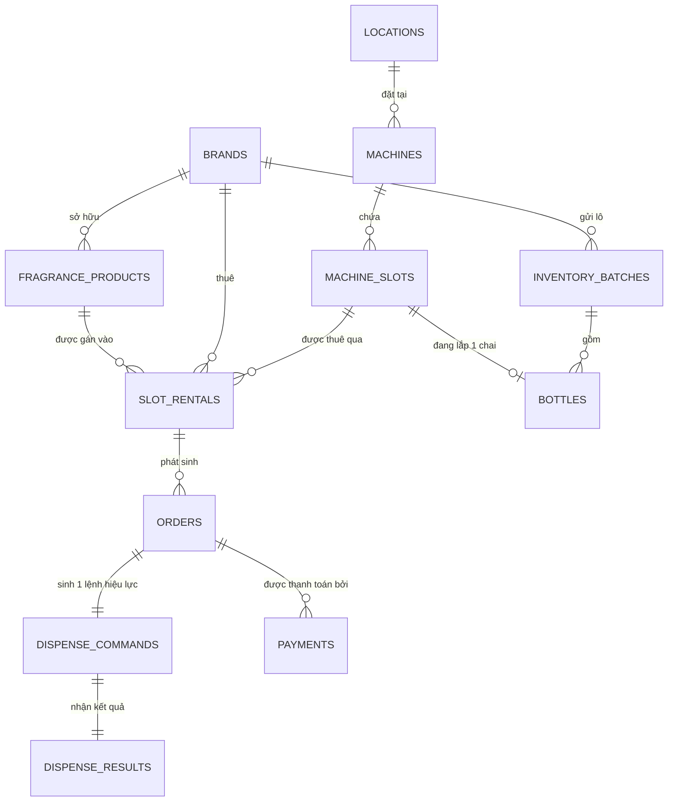
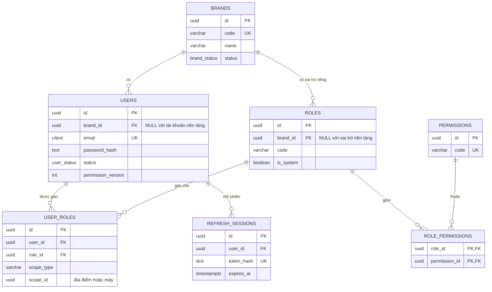
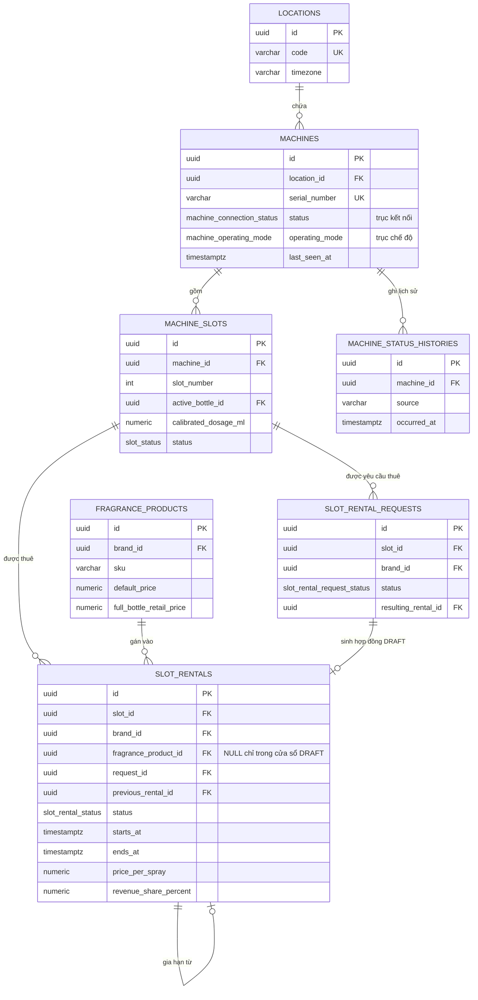
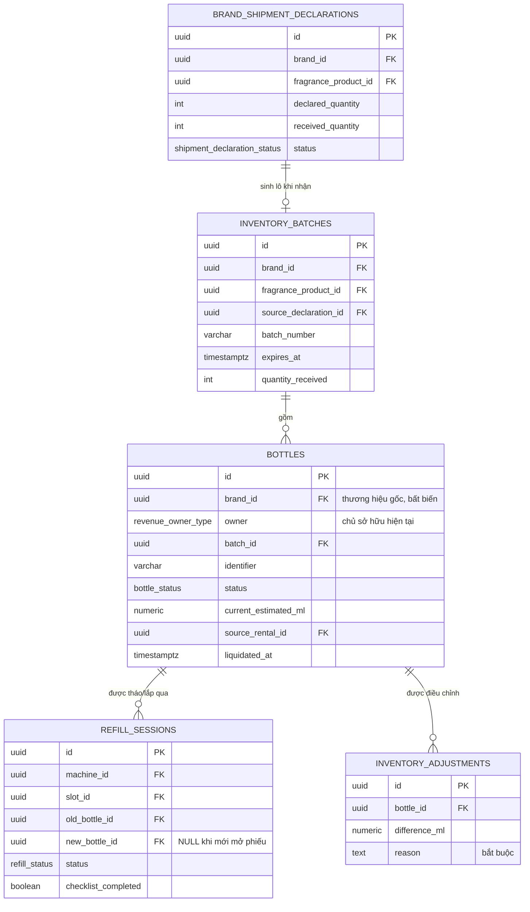
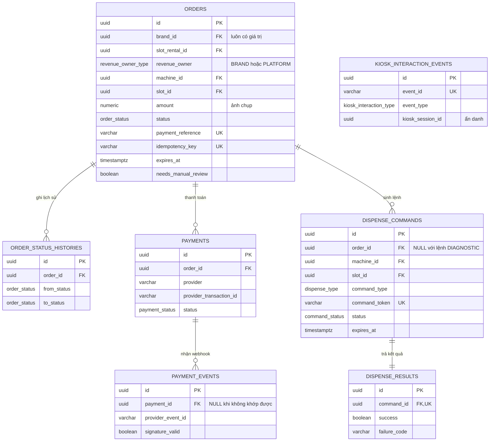
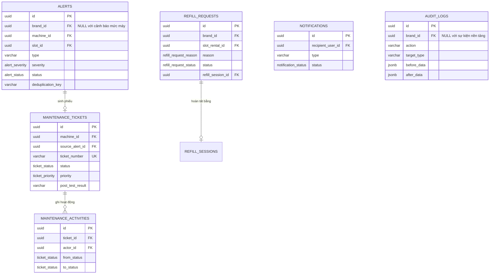
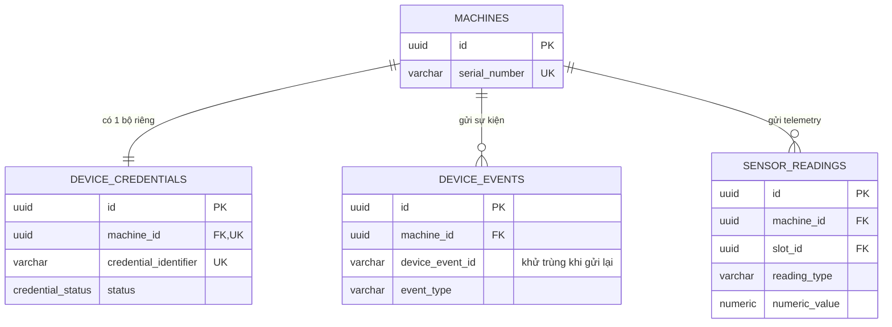

# Sơ đồ thực thể quan hệ (ERD)

> **CONTRACT ĐÓNG BĂNG.** Không sửa trực tiếp. Muốn đổi: viết ADR trong `spec/decisions/`, TV1 duyệt
> (`spec/contracts/README.md`).

Nguồn: `seed_document/DB_DIAGRAM_MERMAID.md` · Chuẩn đặt tên: `spec/decisions/0002-chuan-dat-ten-va-kieu-du-lieu-csdl.md`
Lược đồ thi hành: `spec/contracts/schema.sql` · Mô tả từng cột: `spec/contracts/data-dictionary.md`

35 bảng, chia theo 6 nhóm. Vẽ tất cả vào một hình thì không đọc được, nên tài liệu này có một sơ đồ
tổng quan các quan hệ cốt lõi, rồi 6 sơ đồ chi tiết theo nhóm.

---

## 1. Tổng quan — trục xương sống

Đây là phần cần hiểu trước mọi thứ khác. Ba điểm dễ hiểu sai được đánh dấu bằng ghi chú bên dưới.

**Ba điều dễ hiểu sai** (`spec/glossary.md`):

1. **`machines` KHÔNG có `brand_id`.** Máy thuộc nền tảng. Một máy chứa slot của nhiều thương hiệu.
   Đường duy nhất nối thương hiệu với máy là `slot_rentals`. Truy vấn dữ liệu của thương hiệu phải
   lọc qua `orders`/`slot_rentals`, không bao giờ qua `machines` (BR-003, BR-012).

2. **Một hợp đồng ứng với đúng một slot.** Thương hiệu thuê 3 slot có 3 hàng `slot_rentals` độc lập,
   mỗi hàng có kỳ hạn, sản phẩm và giá riêng, và có thể ở trạng thái khác nhau (BR-009).

3. **`orders` chụp `brand_id`, `slot_rental_id`, `revenue_owner`, `amount` tại thời điểm tạo đơn.**
   Không suy ra từ slot khi truy vấn. `orders.brand_id` luôn có giá trị kể cả với đơn sau thanh lý;
   quyền sở hữu tiền nằm ở `revenue_owner` (FR-REV-01/02/03).

### Quan hệ chai ↔ slot đi theo chiều nào

`machine_slots.active_bottle_id → bottles.id`, **không phải** `bottles.installed_slot_id`. Đặt ở
chiều này thì "một slot tối đa một chai" được bảo đảm bởi chính cardinality của cột; partial unique
index `uq_slot_active_bottle` chỉ cần lo chiều còn lại — một chai không lắp ở hai slot (FR-MCH-07,
ADR-0002).

Hệ quả: hai bảng phụ thuộc vòng (`machine_slots` → `bottles` → `inventory_batches`, và
`bottles` → `slot_rentals` → `machine_slots`), nên khóa ngoại `fk_slot_active_bottle` được tách ra
`ALTER TABLE` ở §9 của `schema.sql`.

---

## 2. Nhóm Identity và Brands

Vai trò là **dữ liệu**, không phải enum: đổi tập vai trò chỉ cần sửa dữ liệu seed, không cần
migration. MVP có 4 vai trò hệ thống — Platform Super Admin, Operations Staff, Inventory Staff,
Brand Admin (`docs/FR_NFR_SCENTSTATION.md` Phần D).

`users.brand_id` NULL với tài khoản mức nền tảng, bắt buộc có giá trị với Brand Admin (FR-AUTH-05).

---

## 3. Nhóm Catalog và Machines

**`machines` có hai trục trạng thái độc lập.** `status` là kết nối, suy ra từ heartbeat (FR-MCH-08,
FR-IOT-01..03). `operating_mode` là chế độ do người vận hành đặt (FR-MCH-09, FR-MNT-05/12). Một máy
có thể vừa `ONLINE` vừa `MAINTENANCE`. `machine_status_histories` ghi cả hai trục vào cùng một bảng
nhưng mỗi hàng chỉ điền một cặp.

**Luồng tự phục vụ của Brand Admin** (FR-SLT-19..29): `slot_rental_requests` (REQUESTED) → duyệt →
`slot_rentals` (DRAFT, chưa có sản phẩm) → Brand Admin gán sản phẩm (FR-SLT-27) → đến ngày bắt đầu
chuyển ACTIVE (FR-SLT-24). Hai bảng trỏ vào nhau (`request_id` ↔ `resulting_rental_id`), nên
`fk_request_resulting_rental` cũng phải tách ra `ALTER TABLE`.

---

## 4. Nhóm Inventory

**`bottles` có hai cột chủ sở hữu, đừng nhầm.** `brand_id` là thương hiệu gốc, bất biến để phục vụ
kiểm toán. `owner` là chủ sở hữu hiện tại, lật sang `PLATFORM` khi thanh lý (FR-EXP-15). Câu hỏi
"chai này của ai" phải đọc `owner`.

**`refill_sessions` chính là phiếu nạp** (FR-INV-29..31), không phải một bảng riêng: `status=STARTED`
là phiếu đang mở, `status=COMPLETED` là phiếu đã đóng. Trong lúc phiếu mở, cảnh báo cửa mở quá hạn
(FR-ALR-03) bị tạm ngưng cho máy/slot đó.

---

## 5. Nhóm Orders và Payments

**Ba ràng buộc duy nhất giữ cho BR-002 đúng:**

| Ràng buộc | Chặn điều gì |
|---|---|
| `uq_payment_event (provider, provider_event_id)` | Cổng thanh toán gửi lại webhook → xử lý hai lần (FR-ORD-15) |
| `uq_order_active_command (order_id)` partial | Một đơn có hai lệnh xịt cùng hiệu lực → xịt hai lần (FR-DSP-05) |
| `dispense_results.command_id` UNIQUE | Một lệnh ghi hai kết quả khác nhau (FR-IOT-07) |

`payment_events.brand_id`/`payment_id` NULL khi webhook không khớp được với đơn nào (chữ ký sai, mã
tham chiếu lạ) — vẫn ghi lại để rà soát bảo mật (FR-ORD-13/14).

`kiosk_interaction_events` tách khỏi `orders` vì ghi cả lượt xem và lượt chọn không dẫn tới đơn hàng
— đây là nguồn dữ liệu cho xếp hạng sản phẩm (FR-RPT-06, BR-007). `kiosk_session_id` là phiên ẩn
danh xoay vòng, không chứa định danh khách hàng.

---

## 6. Nhóm Operations

**`alerts.brand_id` và `maintenance_tickets.brand_id` gần như luôn NULL.** Cảnh báo mức máy
(FR-ALR-01/03/05) và phiếu bảo trì ảnh hưởng nhiều thương hiệu cùng lúc; danh sách thương hiệu bị
ảnh hưởng được **suy ra lúc đọc** bằng cách join `slot_rentals` đang hiệu lực của máy (FR-ALR-09,
FR-MNT-07), không lưu ở cột này. Chỉ cảnh báo mức slot mới điền `brand_id`.

**`audit_logs` chỉ thêm mới.** Cưỡng chế bằng cả `REVOKE UPDATE, DELETE, TRUNCATE` cho role ứng dụng
lẫn trigger `trg_audit_logs_append_only` (FR-AUD-09, NFR-SEC-08).

---

## 7. Nhóm Device và IoT

Quan hệ `machines ↔ device_credentials` là **1-1**, cưỡng chế bằng `UNIQUE` trên `machine_id`: mỗi
máy một bộ thông tin xác thực riêng, không dùng chung (FR-MCH-02, NFR-SEC-07).

`uq_device_event (machine_id, device_event_id)` là cơ chế khử trùng khi thiết bị gửi lại sự kiện đã
lưu tạm sau lúc mất kết nối (FR-IOT-10, FR-IOT-11). Cấu trúc bản tin ở `spec/contracts/mqtt.md`.

---

## 8. Điều ERD không thể hiện được

Sơ đồ chỉ vẽ bảng và khóa ngoại. Những ràng buộc sau quan trọng ngang khóa ngoại nhưng không nhìn
thấy trên hình — đọc §10 và §13 của `spec/contracts/schema.sql`:

- 4 partial unique index bắt buộc + exclusion constraint chống chồng lấn kỳ hạn thuê.
- Trigger append-only cho `audit_logs`.
- Các ràng buộc thuộc tầng domain service: chuyển trạng thái hợp lệ, ràng buộc same-brand
  (sản phẩm/chai phải thuộc thương hiệu đang thuê slot), tính bất biến của các cột ảnh chụp trên
  `orders`.
